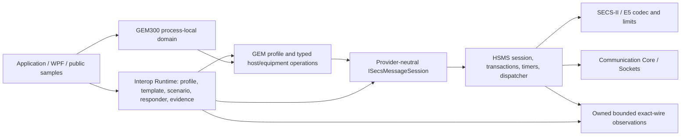

# SECS-II / HSMS / GEM / GEM300 Productization and Verification Report

Verification date: **2026-08-12**
Canonical baseline: `800d22ede863508744e0ead5a96baebd5a82a09a`

This report is the central evidence ledger for the public Dreamine SECS-II,
HSMS, GEM, GEM300, provider-neutral runtime, samples, and WPF interoperability
workbench scope. It separates implementation, local automated evidence,
external interoperability, normative-source availability, and field evidence.
Nothing in this report is a standards certification or a current-edition
conformance claim.

## Status vocabulary and interpretation

Only the following literal statuses are used:

`PASS`, `FAIL`, `IMPLEMENTED_UNVERIFIED`, `BLOCKED_STANDARD`,
`BLOCKED_ENVIRONMENT`, `BLOCKED_INPUT`, `NOT_RUN`, `NOT_APPLICABLE`, and
`INTENTIONALLY_EXCLUDED`.

- `PASS` is bounded by the evidence named in the same row. Local tests cannot
  promote an external simulator, production-equipment, or certification row.
- `IMPLEMENTED_UNVERIFIED` means the implementation surface exists but the
  applicable independent or normative verification level has not been met.
- `BLOCKED_STANDARD` means the required licensed normative source was not
  available. No missing semantic, ACK, state transition, or wire mapping was
  invented.
- `BLOCKED_ENVIRONMENT` means execution was prevented by the available test
  environment, not that the product behavior passed or failed.
- `INTENTIONALLY_EXCLUDED` is an explicit product-scope decision, not an
  implicit promise of later support.

## Executive gate ledger

| Gate | Productization boundary | Status | Final evidence and limitation |
|---|---|---|---|
| 0 | Canonical input, repository closure, normative inventory, and clean evidence boundaries | PASS | Baseline identity fixed; 32-project/64-edge reference closure had no missing project; scoped source and unrelated pre-existing changes were separated; final strict Release solution build completed with 0 warnings and 0 errors. |
| 1 | SECS-II / HSMS Core hardening | PASS | C-01 through C-12 are locally satisfied; final related Release tests are included in the 674/674 aggregate; Core/Profile ownership remains explicit. |
| 2 | Provider-neutral high-level session SDK and bounded Primary dispatcher | PASS | Additive API, typed state, correlated W1 requests, source-bound one-shot replies, deterministic routing/backpressure, and lifecycle regression evidence passed locally. |
| 3 | Shared interoperability Runtime and WPF workbench | PASS | Profile/template/scenario/responder/persistence/exact-wire/privacy and multi-equipment functional evidence passed locally. Visible final WPF inspection is separately `BLOCKED_ENVIRONMENT`; external peers remain `NOT_RUN`. |
| 4 | Public generic GEM Equipment profile, exact frozen name `E30-0611 derived subset profile v1` | IMPLEMENTED_UNVERIFIED | The code surface is revision-scoped and not certified. Unit/fixture evidence and the separate-process actual-TCP Demo run are separately `PASS`; external simulator and equipment remain `NOT_RUN`. |
| 5A | E39/E40/E87/E90/E94 process-local in-memory domain boundary | PASS | Atomic graph, identity, leasing, job lifecycle, cancellation, event journal, and cleanup tests passed locally; the public QuickStart exited 0 and emitted 21 events. |
| 5B | E39.1/E40.1/E87.1/E90.1/E94.1 standard wire bindings | BLOCKED_STANDARD | The required `.1` normative sources were unavailable; no mapping was inferred from base-domain documents. |

The gate ledger is deliberately non-transitive. In particular, Gate 3 local
functional `PASS` does not override the WPF visual `BLOCKED_ENVIRONMENT` row,
and Gate 5A domain `PASS` does not override Gate 5B `BLOCKED_STANDARD`.

## Baseline identity, source closure, and dirty-scope control

| Item | Status | Evidence / disposition |
|---|---|---|
| Canonical root baseline | PASS | `main` and `origin/main` were anchored at `800d22ede863508744e0ead5a96baebd5a82a09a` when the work started. |
| Scoped nested source repositories | PASS | The six SECS/GEM/GEM300 repositories matched their public `main` baseline before scoped changes. Nested-repository commands used repository-local safe-directory configuration only. |
| Project-reference closure | PASS | The canonical graph contained 32 projects and 64 project-reference edges with no missing target. |
| Pre-existing unrelated modifications | PASS | Existing solution, Database, Hybrid, Identity, UI.Blazor, philosophy, debug/output, and other unrelated working-tree changes were preserved and were not reset, cleaned, staged, or rewritten. |
| Generated/local evidence | PASS | `.artifacts`, `.codex-work*`, debug output, and private interoperability evidence are treated as local evidence only and are not publication inputs. |
| Git mutation/publication | NOT_APPLICABLE | No commit, push, PR, tag, release, or NuGet publication was requested or performed. |

The source tree was intentionally dirty during verification. A whole-tree
`git add -A` or equivalent operation would be unsafe because `.artifacts/` is
not covered by the repository's existing `artifacts/` ignore rule. Any future
staging must use an explicit reviewed path allow-list.

## Normative-source inventory and hashes

The locally available Korean reference translations were opened and reviewed
page by page. Their covers identify the English editions as authoritative.
They therefore support revision-scoped traceability only.

| Standard source | Locally reviewed revision | SHA-256 | Status | Permitted conclusion |
|---|---|---|---|---|
| SEMI E5 | E5-0813 | `480166DD7BD67943968BFF54F60E105F4ADA788249FB6B87724F61443F4085CD` | PASS | Revision-scoped SECS-II item/format/encoding traceability. |
| SEMI E30 | E30-0611 | `B473750F769D926C976CA09F7AE1C17D4E3157CC39111F4AD80F0B5AA7DED5C1` | PASS | Revision-scoped generic GEM subset design and traceability. |
| SEMI E37 | E37-0413 | `C70CA8092C13209AF1E233A2D3FC0E9693CE4BF72E87569F5AFA9D535326031E` | PASS | Revision-scoped HSMS Generic Services traceability. |
| SEMI E39 | E39-0703, reapproved 1109 | `0F3DECD10EE67A06D9DF7F6A9EAE0C4AA701717F25AA08060AC3E4E1960D6DAF` | PASS | Process-local object-domain hardening only. |
| SEMI E40 | E40-0312 | `80345C436052269835A114ECF79406D30408ADFF243A46463448C62F5967FD83` | PASS | Process Job domain hardening only. |
| SEMI E87 | E87-0312 | `24F2201BD8E15E029CD7A6DB20DC01EFA76CB571E41D6967A9913E262763D002` | PASS | Carrier-management domain hardening only. |
| SEMI E90 | E90-0312 | `F758F04FAB826F5349F6A0AE7D67CDAE923953FC03D5156BF969714BFE60E403` | PASS | Substrate-tracking domain hardening only. |
| SEMI E94 | E94-0314 | `BF2570B504718529175631A065744C06D1E044104C64AB0D821FE04AC79AA647` | PASS | Control Job domain hardening only. |
| SEMI E37.1 / HSMS-SS | unavailable | `NOT_APPLICABLE` | BLOCKED_STANDARD | No E37.1 conformance claim. |
| E39.1/E40.1/E87.1/E90.1/E94.1 mappings | unavailable | `NOT_APPLICABLE` | BLOCKED_STANDARD | No GEM300 standard wire contract, SxFy body, ACK, or mapping claim. |
| E116/E116.1, E42, E139 | unavailable | `NOT_APPLICABLE` | BLOCKED_STANDARD | No placeholder API or inferred behavior. |

The `NOT_APPLICABLE` hash cells mean no source file existed to hash; they are
not evidence about the unavailable standard's contents.

## Final build and automated-test evidence

All final test projects were executed sequentially in Release configuration.
The common invocation shape was:

```powershell
dotnet test <project> -c Release --no-restore --nologo -warnaserror `
  -p:GeneratePackageOnBuild=false --logger trx
```

No terminated isolated-output experiment is counted. One initial WPF sandbox
attempt could not access the Windows SDK and is not a product failure; the same
strict command was rerun with the required environment access and passed.

| Test project | KST execution window | Passed | Failed | Skipped | Status |
|---|---|---:|---:|---:|---|
| Dreamine.Secs.Abstractions.Tests | 11:26:34–11:26:45 | 74 | 0 | 0 | PASS |
| Dreamine.Secs.Com.Tests | 11:27:19–11:27:43 | 238 | 0 | 0 | PASS |
| Dreamine.Gem.Abstractions.Tests | 11:38:35–11:38:41 | 13 | 0 | 0 | PASS |
| Dreamine.Gem.Tests | 11:38:57–11:39:04 | 78 | 0 | 0 | PASS |
| Dreamine.Gem300.Abstractions.Tests | 11:39:27–11:39:30 | 9 | 0 | 0 | PASS |
| Dreamine.Gem300.Tests | 11:39:51–11:39:54 | 78 | 0 | 0 | PASS |
| Dreamine.SecsGem.Interop.Wpf.Tests | 11:41:54–11:42:13 | 142 | 0 | 0 | PASS |
| Dreamine.SecsGem.FactoryScale.Tests | 11:42:54–11:43:21 | 42 | 0 | 0 | PASS |
| **Total** | **2026-08-12 +09:00** | **674** | **0** | **0** | **PASS** |

TRX output is retained under the local final-verification artifact root. It is
evidence for these exact invocations only and is not a distributable product
input.

Strict Release builds used `--no-restore`, `--nologo`, `-warnaserror`, and
`-p:GeneratePackageOnBuild=false`. The standalone Runtime, WPF workbench,
public Host/Equipment samples, GEM QuickStart, GEM300 QuickStart, and parent
`20_SOURCES/DreamineWorkSpace.sln` builds completed with **0 warnings and 0
errors**. The parent solution build elapsed 164.4 seconds. `NETSDK1057`
identified the installed preview SDK and was
informational, not a build warning.

## Public API inventory and compatibility boundary

The inventories were regenerated by reflection from the final Release
assemblies. Counts below are exported public types, not source-file counts or
public-member counts.

| Assembly | Exported public types | Inventory result |
|---|---:|---|
| Dreamine.Secs.Abstractions | 66 | PASS |
| Dreamine.Secs.Com | 16 | PASS |
| Dreamine.Gem.Abstractions | 50 | PASS |
| Dreamine.Gem | 43 | PASS |
| Dreamine.Gem300.Abstractions | 38 | PASS |
| Dreamine.Gem300 | 10 | PASS |
| Dreamine.SecsGem.Interop.Runtime | 66 | PASS |
| **Total** | **289** | **PASS** |

Compatibility policy remained additive:

- existing low-level `ISecsConnection`, `ISecsCommunicationProvider`,
  `HsmsSession`, and legacy `HsmsGemTransport(HsmsSession, SecsSessionId)`
  surfaces were retained;
- the provider-neutral session, dispatcher, GEM adapter, generic profile,
  GEM300 runtime factories, and interoperability Runtime were added without
  removing an existing interface member;
- session construction options remain snapshots; endpoint, role/mode,
  Session ID, timers, limits, dispatcher, and wire-observation changes require
  validate/stop/recreate rather than unsafe live mutation;
- application-owned sessions and services remain application-owned; adapters
  do not create a second receive loop, transaction manager, or System Bytes
  generator.

The reflection inventory proves that the documented final assemblies were
enumerated. It is not an ABI guarantee for future versions and does not itself
establish external compatibility.

## Coordinated local package candidate and isolated consumer

The coordinated candidate version is **`1.0.99-local.20260812`**. Packing used
an explicit ten-project allow-list; no solution-wide or wildcard pack was used.
Every pack invocation exited 0. This is a local candidate verification, not a
publication or release.

| Package candidate | SHA-256 | Pack result |
|---|---|---|
| Dreamine.Communication.Abstractions | `B24915B236889C4A53BBFE8A5D2BBE5908C41E02C7A305EDF73D08FC95E0D4E6` | PASS |
| Dreamine.Communication.Core | `6D7E76BAD46E3999E2C65CD0086DCFD142735A8BFB1F130102EC1279FB7147C3` | PASS |
| Dreamine.Communication.Sockets | `C72D86E7D51D9F218F958AF10CA2596CBC01E837058998998842DD97C1415450` | PASS |
| Dreamine.Secs.Abstractions | `0B4A43EAB151A26C180F3F8D6CD68D091F336E6D7D2100CEC102CFEC65184543` | PASS |
| Dreamine.Secs.Com | `07502BE9CC0C3031759FD0A6865AF253FF361B3B3898C0983ECA3619A31BC2FF` | PASS |
| Dreamine.Gem.Abstractions | `7DEF37899E39B6C830ED0AB1C3621ABBFDA9B8DCD4B4F0A4528C1299B61DEDAA` | PASS |
| Dreamine.Gem | `F4C749DE570F9ED572C21EF84D2DF0EF847E4EBDDCBB7EFC00649CF3B2296A4D` | PASS |
| Dreamine.Gem300.Abstractions | `88A33D9E50F6C128A2BA42603E019835CC497920EE8EE81690B981D5D18C7074` | PASS |
| Dreamine.Gem300 | `A1F5621DCA589EC95E4CD030233EF0D09B64C2852720890C406208F06E1B5EF1` | PASS |
| Dreamine.SecsGem.Interop.Runtime | `FF7935D83B00F8CB952754E39F4EC5CA126B588F12E46517A1CB3042DFC7FB70` | PASS |

Package inspection produced the following bounded results:

| Check | Result | Status |
|---|---:|---|
| Explicit package allow-list | 10/10 expected package IDs | PASS |
| In-scope `.nuspec` dependency versions | exact `1.0.99-local.20260812` candidate version | PASS |
| Forbidden PDF entries | 0 | PASS |
| Forbidden PDB entries | 0 | PASS |
| Source-code entries | 0 | PASS |
| Log / JSONL entries | 0 | PASS |
| Private / customer entries | 0 | PASS |
| `.artifacts` / `.codex` entries | 0 | PASS |
| WPF and executable sample packages | 0 | PASS |

The consumer smoke test was copied to a fresh temporary directory outside the
source tree. It used a local-only `NuGet.Config`, an isolated package cache,
and `PackageReference` only. Its restore, strict build, and run all exited 0;
the build completed with 0 warnings and 0 errors.

| Isolated-consumer check | Result | Status |
|---|---:|---|
| Packages resolved | 10 | PASS |
| Project libraries in assets graph | 0 | PASS |
| `ProjectReference` entries | 0 | PASS |
| Canonical workspace path hits | 0 | PASS |
| Runtime smoke output | `PACKAGE_SMOKE_PASS\|SID=37\|HEADER_ONLY=14\|PROJECT_REFERENCE=0` | PASS |

The smoke program exercised E5/JIS-8, a GEM variable, the GEM300 event journal,
the Demo profile with Session ID 37, a Runtime template, a scenario validation
path, and a 14-byte `HeaderOnly` observation. The first sandboxed restore was
`BLOCKED_ENVIRONMENT` because the user-level NuGet configuration was not
readable there; it is not counted as a candidate failure. The approved
unsandboxed rerun with the same local-only feed and isolated cache is the
`PASS` evidence above.

No package was uploaded, published, tagged, or released. These hashes identify
only the local candidate artifacts from this run.

## Architecture and ownership



Ownership rules that close the major double-owner risks are:

1. one application-owned HSMS session owns the socket, receive loop,
   transactions, timers, System Bytes, and selected-generation fencing;
2. one bounded Primary dispatcher determines a single owner by exact route,
   fallback, then legacy event only when unclaimed;
3. a reply context captures source connection identity, Session ID, Stream,
   System Bytes, epoch, and selected generation, and is consumed on its first
   reply attempt whether that attempt succeeds, fails, or is cancelled;
4. exact-wire logging consumes the session observation stream and never opens
   a competing receive loop or labels canonical re-encoding as captured wire;
5. GEM300 managers participating in one graph share the same gate, identity,
   Process Program service, leases, and execution-claim authority.

## Gate 1 — SECS-II / HSMS Core acceptance

| ID | Acceptance condition | Status | Final local evidence boundary |
|---|---|---|---|
| C-01 | Cancel Passive accept through stop/disconnect/dispose | PASS | Cancellation, immediate Passive relisten, and run-start publication barriers are covered; a fresh Passive listen is not delayed by T5. |
| C-02 | Separate failure reconnect from intentional stop | PASS | Explicit stop cancels scheduled reconnect; obsolete receive/reconnect runs cannot publish; terminal bind failure does not reconnect. |
| C-03 | Keep T5 distinct from operational backoff | PASS | T5 reconnect remains Active-only; Passive relisten is immediate; no unrelated backoff is labeled T5. |
| C-04 | Do not re-encode diagnostics | PASS | Send/receive diagnostics use actual encoded/read lengths and exact-wire tests do not require a second encode. |
| C-05 | Owned bounded wire observation | PASS | Opt-in capture defensively copies only the configured prefix, reports truncation/drop/sequence/epoch, never waits for its consumer, and stays off the allocation path when disabled. |
| C-06 | Preserve Core/Profile responsibility | PASS | Core validates HSMS header/control/frame and generic E5 syntax/limits; SxFy cardinality, ACK, unknown-ID, Stream 9 application action, and duplicate-side-effect policy remain above Core. |
| C-07 | Retain header context without inventing a reply | PASS | Decode diagnostics preserve a typed header when complete; Core does not synthesize an unsupported Reject or Stream 9 message. |
| C-08 | Bounded lifecycle and owned workers | PASS | Bind failure, stale epochs, selected-generation send fencing, reentrancy, timers, transactions, worker failure, and deferred cleanup are exercised. |
| C-09 | Complete supported E5 format inventory | PASS | The 15 supported formats include an independent JIS-8 golden vector; E5 format code 18 remains `INTENTIONALLY_EXCLUDED`. |
| C-10 | Propagate allocation limits | PASS | Frame/message/depth/list limits flow through options and codec paths and reject input before message-sized allocation. |
| C-11 | Account for Communication dependencies | PASS | Project dependencies remain explicit. Dependency removal was neither required nor used as acceptance evidence. |
| C-12 | Release regression closure | PASS | Final aggregate is 674/674; standalone and parent strict Release builds completed with 0 warnings/0 errors. |

The synchronous legacy `MessageReceived` event remains for compatibility.
Subscriber exceptions are isolated, but a non-returning synchronous subscriber
can still delay receive progress and deferred cleanup after the bounded public
shutdown wait. New code should use the bounded dispatcher.

## Gate 2 — provider-neutral session and dispatcher

| Capability | Status | Decision and evidence |
|---|---|---|
| Provider-neutral lifecycle/state | PASS | `ISecsMessageSession` and provider contracts expose typed TCP/HSMS state, Select/Deselect/Linktest/Separate, expert sends, allocated W0 sends, and correlated W1 requests. |
| Dialogue validation | PASS | Normal Primary/Secondary pairs require the declared adjacent even Secondary; F0 is an explicit transaction-termination special case, not a normal Secondary. |
| Primary routing | PASS | Fixed workers and bounded FIFO use exact registration, fallback, then legacy event only if unclaimed. A claimed Primary rejected at capacity is counted and is not offered to a second owner. |
| Source-bound one-shot replies | PASS | Stale contexts cannot reply after reconnect; the first attempt consumes reply ownership. |
| Retry/reconnect policy | PASS | Generic Primary auto-retry remains absent. Active reconnect uses T5; Passive relisten remains immediate. |
| Runtime/provider ownership | PASS | `HsmsGemTransport(ISecsMessageSession)` uses session identity and does not dispose the application-owned session. |

### Reproduced lifecycle defect and remediation

Five repeated downstream WPF runs first exposed a dispatcher shutdown race:
three failed when the last worker disposed its lifetime cancellation source
before `StopAsync` called `Cancel`, producing `ObjectDisposedException` and one
remaining measured session during cleanup. A deterministic regression that
completed every worker before `StopAsync` reproduced the fault.

Cancellation/disposal ownership now belongs to stop-and-drain: cancellation
occurs before queue completion, and the cancellation source is disposed
idempotently after workers drain, including reentrant and cancelled-wait paths.
The deterministic regression and repeated isolation/full-suite runs then
passed. This defect is included in the final Gate 2 `PASS` result.

## Gate 3 — interoperability Runtime and WPF workbench

### Runtime capability matrix

| Surface | Status | Implemented and verified local boundary |
|---|---|---|
| Connection Profile v1 | PASS | Credential-free endpoint, role/mode, Session ID, timers, limits, reconnect, registered log-policy ID, validation/diff, and stop/recreate semantics. |
| Message Template Catalog v1 | PASS | Bounded immutable item trees, explicit direction and Primary/Secondary role, W-bit, and body-log policy. Templates are application data, not normative SxFy definitions. |
| Scenario v1 | PASS | Bounded run/step deadlines, cancellation, repeat limits, state waits, sends, expectations, structured exit, and dropped-inbound failure eligibility. |
| Configurable Responder v1 | PASS | Exact dispatcher registration; immediate, delayed, or deliberate no-reply behavior; bounded shutdown. |
| Versioned JSON persistence | PASS | Schema versions, input limits, stable snapshots, and atomic replacement boundaries. |
| Exact-wire JSONL logging | PASS | Actual observation bytes, `HeaderOnly` safe default, bounded retention, drop/sequence/truncation accounting, idempotent stop, flush/writer health gate. |
| Multi-equipment orchestration | PASS | Independent contexts, bounded fan-out, reconnect isolation, correlation, fault handling, and zero tracked resource counters after tested cleanup. |
| Headless/public result privacy | PASS | Closed result DTO exposes status/exit/UTC/counts/drop counters and stable safe reason codes; endpoint is always `redacted`; free-form errors, paths, provider details, raw frames, and decoded bodies are withheld. |
| WPF E30 responder selection | IMPLEMENTED_UNVERIFIED | Exact selector label and binding exist; the E30 router is mutually exclusive with the educational Demo-only fallback. This row is not external or visual evidence. |
| Visible final WPF layout | BLOCKED_ENVIRONMENT | The available computer-control environment could not launch the app because approval/elicitations were unavailable. Historical fallback captures do not replace the requested final visual inspection. |
| External SEComSimulator interoperability | NOT_RUN | No external counterpart evidence was executed. |
| Real equipment / field validation | NOT_RUN | No production endpoint was used. |

The exact WPF selector labels are **E30-0611 derived subset profile v1
(Demo)** and **Educational basic responder (Demo-only, not GEM)**. Only one
responder path is active at a time.

### Wire-evidence eligibility

A local run is eligible as wire evidence only when:

- the observation drop count and recorder drop count are zero;
- sequence gaps and capture truncation are interpreted explicitly;
- final flush completed and no writer failure occurred;
- Session ID, direction, SxFy/W-bit, and System Bytes correlation match the
  expected dialogue; and
- captured bytes are the session's actual read/write bytes, not a canonical
  re-encoding.

`HeaderOnly` is the safe default. `FullBodyExplicit` requires approved
per-S/F rules and application-owned protected storage; the safe facade rejects
a global full-body selection.

## Gate 4 — frozen E30-derived generic Demo profile

The exact profile name is **`E30-0611 derived subset profile v1`**. It is a
small public, customer-neutral Demo profile. Its implementation status remains
`IMPLEMENTED_UNVERIFIED` even though the bounded local evidence below is
`PASS`.

### Frozen normal-dialogue manifest

| Direction in the public Demo run | Dialogues | Local evidence |
|---|---|---|
| Host request → Equipment response | S1F1/F2, S1F3/F4, S1F11/F12, S1F13/F14, S1F15/F16, S1F17/F18; S2F13/F14, S2F15/F16, S2F17/F18, S2F29/F30, S2F31/F32, S2F33/F34, S2F35/F36, S2F37/F38, S2F41/F42; S5F3/F4, S5F5/F6; S6F15/F16 | PASS |
| Equipment Primary → Host response | S5F1/F2, S6F11/F12 | PASS |
| Additional explicit Equipment-origin operations | S1F1/F2, S2F17/F18 | PASS |
| Router-exposed Equipment-origin operation | S1F13/F14 | PASS |

The 20-entry manifest is directional. It must not be interpreted as every
dialogue being supported in both directions.

### Local actual-TCP process evidence

The public `Dreamine.Gem.QuickStart` was executed as separate passive
Equipment and active Host processes over TCP/HSMS, not as a shared in-process
mock.

| Evidence item | Observed result | Status |
|---|---:|---|
| Process exit codes | Host 0; Equipment 0 | PASS |
| Elapsed wall time | approximately 5.05 s | PASS |
| Nonzero Session ID | 37 | PASS |
| Frozen manifest coverage | 20/20 dialogues | PASS |
| Required Primary direction claims | 22/22 | PASS |
| Correlated normal transactions | 23 | PASS |
| Intentional pre-communication timeout | exactly 1 | PASS |
| Wire-observation drops | 0 | PASS |
| Host typed outcomes | success, timeout, cancellation, and raw ACK observed | PASS |

This row proves only the exact two-process local run. It does not convert the
profile implementation to standards conformance and does not promote external
interoperability beyond `NOT_RUN`.

Reproduction shape:

```powershell
# terminal 1
dotnet run --project samples/Dreamine.Gem.QuickStart -- `
  --role equipment --host 127.0.0.1 --port 5000 `
  --session-id 37 --timeout-seconds 45 --evidence equipment-evidence.json

# terminal 2
dotnet run --project samples/Dreamine.Gem.QuickStart -- `
  --role host --host 127.0.0.1 --port 5000 `
  --session-id 37 --timeout-seconds 45 --evidence host-evidence.json
```

### E30 semantic remediation matrix

| Area | Status | Final local behavior / limitation |
|---|---|---|
| Alarm enable/disable encoding | PASS | ALED uses one-byte binary `0x80` for enable and `0x00` for disable. |
| Mandatory W-bit requests | PASS | W1 is checked before application mutation; invalid W0 requests cannot mutate state. |
| Identifier formats | PASS | DATAID remains independently configurable from CEID/RPTID/VID/SVID/DVID/ECID/ALID. |
| Empty linked reports | PASS | S6F16 emits the required empty list shape for the tested empty result. |
| Control/communication state gates | PASS | Outbound operations respect communication/control state, including HostOffline. |
| Remote command completion | PASS | Command ACK does not fabricate a completion event; completion is published only from an actual application completion path. |
| Stream 9 direction and correlation | PASS | All supported S9 errors are Equipment→Host. S9F3/F5/F7/F11 preserve the actual offending ten-byte header and offending Session ID/System Bytes correlation in local TCP evidence. |
| S2F35 empty/unlink semantics | BLOCKED_STANDARD | Empty outer-list and empty RPTID-list unlink/delete meaning is not guessed; v1 terminates without mutation. |
| S6F19 unknown RPTID representation | BLOCKED_STANDARD | No body/ACK semantic is invented. |
| S9F1, S9F9, S9F13 | INTENTIONALLY_EXCLUDED | The safe provider/router boundary lacks sufficient source context for a non-invented frozen-v1 implementation. |
| Multi-block S2F39/F40 and S6F5/F6 | INTENTIONALLY_EXCLUDED | Outside frozen v1. |
| Trace, limits, wire spooling, S7, S10, material handling, enhanced remote command | INTENTIONALLY_EXCLUDED | Outside frozen v1. |
| External simulator | NOT_RUN | Requires independent counterpart evidence. |
| Production equipment | NOT_RUN | Requires field evidence and customer-owned profile validation. |

## Gate 5 — process-local GEM300 domain

### Base-domain capability matrix

| Domain | Status | Implemented local boundary |
|---|---|---|
| E39-style object services | PASS | Stable identity, typed RO/RW attributes, cancellable actions, application-declared projections, reserved projection keys, source-of-truth reads, blocked raw projected mutation/removal, and typed application action routing. |
| E87 carrier management | PASS | Load-port/service state and atomic carrier/substrate acceptance and removal. |
| E90 substrate tracking | PASS | Explicit location occupancy, residence history, processing state, reference leases, and application-declared slot/substrate assignments. |
| E40 Process Jobs | PASS | Process Program identity, material leases, lifecycle ownership, cancellation, and safe stop/abort behavior. |
| E94 Control Jobs | PASS | Serial queue, central Process Job ownership, shared execution claims, and coordinated cleanup. |
| Shared graph integrity | PASS | Managers must share the exact domain gate and graph identity; incompatible external compositions fail fast at construction. |
| Event evidence | PASS | Bounded process-local journal has a stable journal identity, retention/drop health, and a shared non-throwing publisher. |
| Runtime composition | PASS | `Gem300Runtime.CreateFromGemRuntime` reuses the concrete GEM runtime's Process Program store; compatible constructor use must supply the same logical service. |

### Integrity and failure-semantics closure

- Projection entries are application-declared views. Raw writes/removals of
  projected state are rejected; business mutation uses typed actions.
- Carrier slot/substrate association is explicit. A legacy nonempty arrival
  plan without an unambiguous assignment fails instead of inferring a slot
  index from ordering or location text.
- Carrier, substrate, Process Job, and Control Job operations share atomic
  leases/claims, preventing duplicate ownership and partial graph mutation.
- Stop/abort processor results do not mark substrates `Processed` and do not
  promote the Control Job through its normal-success path.
- User callbacks, cancellation-source disposal, `TimeProvider` work, and event
  publication occur outside graph locks. Failure cleanup moves state forward
  without exposing a half-mutated graph.
- Public signatures that allowed unsupported external manager composition were
  retained for source compatibility, but invalid graph identity now fails at
  construction rather than corrupting state later.

### QuickStart evidence

| Scenario | Result | Status |
|---|---|---|
| Shared Process Program service and runtime composition | same instance used by GEM and GEM300 | PASS |
| Load port, explicit carrier slots, substrates, Process Job, Control Job, processing, removal | completed in order | PASS |
| Process exit | 0 | PASS |
| Journal output | `Workflow completed with 21 domain event(s).` | PASS |
| HSMS/GEM300 wire traffic | no connection opened | NOT_APPLICABLE |

The executable command was:

```powershell
dotnet run --project samples/Dreamine.Gem300.QuickStart
```

### GEM300 blocked and excluded scope

| Scope | Status | Reason |
|---|---|---|
| E39.1/E40.1/E87.1/E90.1/E94.1 standard wire bindings | BLOCKED_STANDARD | Required licensed mapping documents were unavailable. |
| E116/E116.1, E42, E139 | BLOCKED_STANDARD | Required normative sources were unavailable; no placeholder contract was created. |
| Control Job `Completed` distinction for abort versus normal completion | BLOCKED_STANDARD | The unavailable normative meaning prevents a stronger semantic claim; tested failure paths do not falsely mark normal processing success. |
| External GEM300 simulator/equipment | BLOCKED_STANDARD | Standard wire execution cannot be responsibly defined without the applicable `.1` sources. |
| Durable persistence and restart recovery | INTENTIONALLY_EXCLUDED | Gate 5 is explicitly process-local and in-memory. |
| Cross-process ownership/locking | INTENTIONALLY_EXCLUDED | No distributed authority or recovery protocol is claimed. |

## Defect-to-fix ledger

| Defect/risk found during productization | Remediation | Status | Evidence boundary |
|---|---|---|---|
| Passive accept and stale-run lifecycle publication races | Added cancellation, generation/epoch fencing, immediate relisten, and bounded cleanup barriers. | PASS | Core lifecycle regression tests. |
| Dispatcher cancellation source disposed before stop | Centralized cancel/complete/drain/dispose ownership and idempotence. | PASS | Deterministic reproduction plus repeated WPF/dispatcher regression. |
| Competing consumer/double-reply risk | Added exact single-owner dispatcher routing and source-bound one-shot reply context. | PASS | Provider-neutral and integration tests. |
| Diagnostic re-encoding mislabeled as wire capture | Added owned actual-byte observation contract with truncation/drop/sequence/epoch metadata. | PASS | Exact-wire tests. |
| Headless output could expose endpoint/free-form diagnostics | Replaced it with a closed allow-list DTO, redacted endpoint, and stable safe reason codes. | PASS | Hostile privacy regression. |
| E30 alarm/W-bit/identifier/empty-list/state/error-direction ambiguities | Corrected locally testable semantics and explicitly blocked or excluded unresolved meanings. | PASS | Unit, fixture, router loopback, and two-process TCP evidence; E30 implementation remains `IMPLEMENTED_UNVERIFIED`. |
| Remote command ACK could imply completion | Separated acceptance ACK from application completion event. | PASS | E30 fixture/TCP tests. |
| GEM300 projection mutation and ambiguous slot inference | Reserved projection keys, typed actions, explicit assignments, and fail-fast legacy handling. | PASS | Domain/integrity regression. |
| Split GEM300 graph identities and duplicate job ownership | Added shared gate/identity validation, leases, and execution claims. | PASS | Concurrency/integrity regression. |
| Stop/abort could be promoted to processed/success | Added forward-only failure cleanup that withholds processed and normal-success transitions. | PASS | Workflow failure regression. |
| Callbacks/disposal/publication under locks | Moved callbacks, cancellation disposal, time-provider work, and journal publication outside graph locks. | PASS | Reentrancy/cancellation/concurrency tests. |

Independent final closure audits reported no open P0/P1 issue in the scoped
Core, Runtime, GEM, GEM300, security, or package-boundary code at the time of
this report. This is an engineering review result, not independent standards
certification.

## Lifecycle, performance, and resource evidence

### Current 2026-08-12 execution status

| Surface | Status | Exact boundary |
|---|---|---|
| Fresh functional/lifecycle regression | PASS | 674/674 Release tests; bounded queues, correlation, reconnect isolation, cancellation, and tracked cleanup assertions. |
| Fresh WPF performance benchmark | NOT_RUN | No current throughput/UI responsiveness measurement was executed. |
| Fresh multi-equipment performance benchmark | NOT_RUN | Functional scale tests passed, but no new normalized performance record was created. |
| Visible WPF responsiveness/layout | BLOCKED_ENVIRONMENT | Final computer-control launch was unavailable. |
| Six-hour / 24-hour soak | NOT_RUN | No extended-duration result is claimed. |
| External network/simulator capacity | NOT_RUN | Local loopback cannot model an external process, network, or equipment. |
| Production SLA | NOT_APPLICABLE | No throughput, latency, memory, or capacity SLA is established here. |

Bounded implementation is not a performance result. The WPF visible-log path
batches at most 250 queued entries per background dispatcher operation, uses
row/column recycling virtualization, and retains at most the newest 10,000
paused entries. These are design limits, not measured responsiveness.

### Retained historical local evidence

The following dated results are preserved for comparison only and were not
rerun as the fresh final performance suite. They do not override current
`NOT_RUN` rows.

| Dated local surface | Historical result | Status | Limitation |
|---|---:|---|---|
| 2026-08-10 headless log collection | 10,000 additions in 15.542 ms; exactly 10,000 retained | PASS | Local process only; no UI or storage SLA. |
| 2026-08-10 single-equipment synthetic loopback | 1,000 correlations, 100 reconnects, 100 Linktests, 20 concurrent primaries in 0.839 s; P95 0.5884 ms | PASS | Local synthetic peer only. |
| 2026-08-10 multi-equipment synthetic loopback | up to 50 endpoints; 1,239/1,241 successful messages with two injected non-success paths; cleanup counters zero | PASS | Environment metadata was incomplete; not normalized capacity evidence. |
| FactoryScale retained Idle-1000 one-hour run | 1,000 selected; 62,000 Linktest exchanges including baseline; unintended timeout/failure/correlation 0; cleanup resources/sockets zero | PASS | Exact retained self-loopback profile only. |
| FactoryScale retained Normal-500 one-hour run | 1,799,999 workload pairs; last interval 499.9985 pairs/s; cleanup resources/sockets zero | PASS | Exact retained self-loopback profile only. |
| FactoryScale retained Busy-100 one-minute run | 59,987 workload pairs; last interval 999.2392 pairs/s | PASS | Exact retained self-loopback profile only. |
| FactoryScale retained Trace-20 one-minute run | 119,988 workload pairs; last interval 1,998.8967 pairs/s; diagnostic drops 0 | PASS | Exact retained self-loopback profile only. |
| FactoryScale retained multi-process 250/5 run | 250/250 Selected; 502/502 pairs; five graceful zero-resource worker exits | PASS | Local worker processes only. |
| FactoryScale retained 500/5 reconnect run | 100/100 reconnect; 1,001/1,001 pairs; peak 16/16; worker cleanup zero | PASS | Local worker processes only. |
| FactoryScale 6-hour/24-hour profiles | no execution | NOT_RUN | Extended-duration claim remains absent. |

Memory deltas, working set, heap, thread, handle, and socket observations are
diagnostic values, not proof of leak freedom. The lifecycle acceptance gate is
zero explicitly tracked sessions/listeners/pending/control/reconnect
operations, queue depth, and process-owned sockets for the exact scenarios
that measured them.

## Interoperability evidence matrix

| ID | Peer / scenario | Status | Required interpretation |
|---|---|---|---|
| A-01 | Dreamine local Active Host ↔ Passive Equipment: TCP, Select, Linktest, S1 correlation, reconnect | PASS | Final local regression only. |
| A-02 | Profile/template/scenario/responder Runtime | PASS | Shared provider-neutral Runtime, bounded execution, structured result. |
| A-03 | Exact-wire observation and bounded JSONL | PASS | Local evidence health gate passed in tests. |
| A-04 | Closed privacy export and redaction | PASS | Allow-list and hostile-input regression. |
| A-05 | Dreamine multi-equipment synthetic loopback | PASS | Functional isolation/cleanup only; not external capacity. |
| A-06 | WPF final visible layout | BLOCKED_ENVIRONMENT | Manual visual evidence still required. |
| G-01 | E30 frozen public implementation | IMPLEMENTED_UNVERIFIED | Revision-scoped code surface; not a conformance verdict. |
| G-02 | Separate Dreamine Host/Equipment actual TCP | PASS | Both processes exited 0; SID 37; 20/20 manifest; 23 correlations; expected timeout 1; drops 0. |
| B-01 | Simulator Host Active ↔ Dreamine Equipment Passive: connect/select/linktest | NOT_RUN | Requires both applications' evidence. |
| B-02 | Same pairing: supported S1 and selected frozen E30 dialogues | NOT_RUN | Execute only counterpart-supported shapes. |
| B-03 | Same pairing: disconnect/reconnect/repeated traffic | NOT_RUN | Local reconnect evidence cannot promote this row. |
| C-01 | Dreamine Host Active ↔ Simulator Equipment Passive | NOT_RUN | Requires an Equipment/Local simulator mode. |
| D-01 | Dreamine Passive ↔ Simulator Active cross-check | NOT_RUN | Requires operator evidence. |
| D-02 | Dreamine Active ↔ Simulator Passive cross-check | NOT_RUN | Requires operator evidence. |
| F-01 | External T3/T6/T7/T8 and malformed/partial-frame peer | NOT_RUN | Local injected faults cannot promote external behavior. |
| G3-01 | External GEM300 standard-wire scenarios | BLOCKED_STANDARD | Applicable `.1` sources unavailable. |
| X-01 | Legacy SECS-I transport | INTENTIONALLY_EXCLUDED | Product transport scope is HSMS/SECS-II. |

An external row may become `PASS` only when TCP/HSMS state, direction, SxFy,
W-bit, nonzero Session ID, System Bytes correlation, typed body/ACK, and
disconnect/reconnect behavior match the expected scenario; wire-evidence
health is eligible; and artifacts from both applications are retained and
hashed. A Dreamine-only log or local prediction is insufficient.

## Commercial-readiness comparison

This is a capability-gap comparison against common expectations for a
commercially deployed SECS/GEM product, not a benchmark against a named vendor.
No vendor product was installed or tested.

| Commercial expectation | Dreamine evidence | Current status | Remaining commercial gap |
|---|---|---|---|
| Bounded SECS-II/HSMS transport, timers, lifecycle, correlation, limits | Broad local regression and strict builds | PASS | External protocol matrix and field soak remain required. |
| Provider-neutral integration API with explicit ownership | Additive session/dispatcher/runtime contracts and API inventory | PASS | Long-term versioning/support policy is a release decision outside this verification. |
| Generic GEM equipment profile with typed host/equipment operations | Frozen E30-0611-derived public Demo and local actual-TCP run | IMPLEMENTED_UNVERIFIED | Independent simulator/equipment evidence and licensed revision review are required. |
| Configurable profile/template/scenario/responder workbench | Shared Runtime and WPF functional regression | PASS | Final visual usability validation is `BLOCKED_ENVIRONMENT`; external operator workflow is `NOT_RUN`. |
| Auditable exact-wire evidence with privacy controls | Owned observation stream, bounded JSONL, health gate, redacted closed DTO | PASS | Retention/access/incident policy must be supplied by the deploying organization. |
| GEM300 carrier/substrate/process/control domain integrity | Process-local atomic domain tests and QuickStart | PASS | Durable recovery and distributed ownership are `INTENTIONALLY_EXCLUDED`. |
| GEM300 standards wire integration | No guessed `.1` mapping | BLOCKED_STANDARD | Acquire/review the applicable licensed `.1` sources before design or claims. |
| Named-vendor simulator interoperability | No external execution | NOT_RUN | Execute the controlled bidirectional matrix and retain counterpart evidence. |
| Production-equipment qualification and customer profile | No field endpoint/customer profile in public scope | NOT_RUN | Customer-owned profile, safety review, FAT/SAT, and change control are required. |
| Extended-load operational qualification | Existing bounded local comparisons; no fresh 6 h/24 h run | NOT_RUN | Repeat normalized 6 h/24 h runs and failure/recovery drills on target hardware. |
| Named commercial-vendor feature/performance comparison | No vendor benchmark | NOT_RUN | Define licensed products, versions, workloads, success criteria, and comparable environments first. |

The comparison supports prioritization only. It does not claim that Dreamine
is equivalent or superior to a commercial product.

## Security, privacy, and publication-scope audit

| Check | Status | Result |
|---|---|---|
| Customer/private standards artifacts in public source scope | PASS | No customer-specific profile, private standard PDF, private endpoint, credential, token, or private simulator artifact was introduced into the reviewed public product scope. |
| Headless evidence exfiltration boundary | PASS | Closed allow-list, endpoint redaction, safe reason codes, no free-form exception/path/provider/raw-body fields. |
| Wire-log default | PASS | `HeaderOnly`; full-body requires explicit per-S/F application approval and protected storage. |
| Evidence completeness signal | PASS | Drop counters, sequence, truncation, flush, and writer health remain explicit. |
| Accidental executable/sample publication | PASS | WPF and public executable sample projects explicitly disable packing/generate-on-build. |
| Broad staging safety | PASS | No staging occurred; explicit-path staging is required because local artifact roots are present. |
| Commit/push/tag/release/publication | NOT_APPLICABLE | None performed. |

Operational metadata such as timestamps, Session ID, System Bytes, SxFy,
local paths, and timing can still be sensitive even when message bodies are
excluded. Deployments must protect product-owned log roots and keep customer
or simulator evidence outside public source and distribution inputs.

## Residual risk and field-verification plan

| Residual / next evidence class | Current status | Exit condition |
|---|---|---|
| Final WPF visible layout at 1366×768, 1920×1080, compact sizing, scaling, scrolling, long names, active logs, and error states | BLOCKED_ENVIRONMENT | Manual screenshots and a reviewed checklist from the final Release executable. |
| SEComSimulator Host Active ↔ Dreamine Equipment Passive | NOT_RUN | Connect/Select/Linktest, supported S1/E30 rows, exact correlation, reconnect, both-side logs/screenshots, hashes. |
| Dreamine Host Active ↔ simulator Equipment Passive | NOT_RUN | Same evidence, only if the installed simulator supports Equipment/Local mode. |
| Active/Passive mode cross-check | NOT_RUN | Both directions executed with matching endpoint/session configuration and retained evidence. |
| External timer/fault behavior | NOT_RUN | Controlled T3/T6/T7/T8 and malformed/partial input from an independent peer. |
| Real equipment / production network | NOT_RUN | Customer-controlled profile review, safety/change approval, FAT/SAT plan, monitored evidence, rollback. |
| E37.1 conformance review | BLOCKED_STANDARD | Acquire the applicable licensed E37.1 source and perform a new trace/audit. |
| GEM300 `.1` wire work | BLOCKED_STANDARD | Acquire the applicable E39.1/E40.1/E87.1/E90.1/E94.1 sources before API or wire implementation. |
| Durable/restart/cross-process GEM300 domain | INTENTIONALLY_EXCLUDED | Requires a separately authorized product-scope expansion and persistence/ownership design. |
| Six-hour/24-hour normalized soak | NOT_RUN | Target hardware/environment record, exact workload, UTC window, raw artifacts, cleanup evidence, and repeated comparable run. |

## Final evidence boundary

- Local loopback, fixtures, tests, and strict builds are local engineering
  evidence only.
- The frozen E30 profile code surface remains `IMPLEMENTED_UNVERIFIED` even
  where individual local automated rows are `PASS`.
- External simulator, production equipment, field performance, and named
  vendor comparison remain `NOT_RUN`.
- E37.1 and GEM300 `.1` conformance/wire claims remain `BLOCKED_STANDARD`.
- Legacy SECS-I, the named frozen-profile exclusions, and process-local GEM300
  persistence/distributed ownership remain `INTENTIONALLY_EXCLUDED`.
- No certification, current-edition standards conformance, external-equipment
  compatibility, universal capacity, or publication claim is made.
