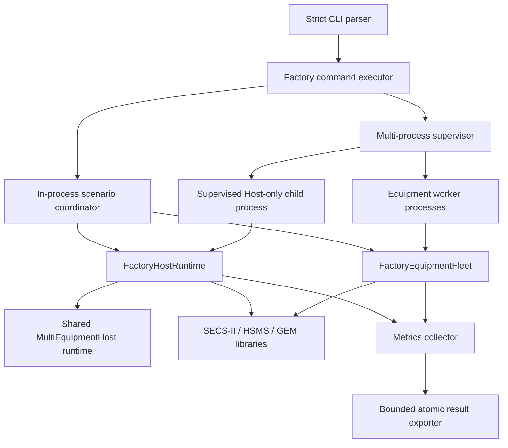

# Factory-Scale Architecture

## Scope and evidence boundary

`Dreamine.SecsGem.FactoryScale` is a headless Demo/Test runner for measuring the Dreamine SECS/GEM Host under many real TCP loopback connections. It is not a product Equipment simulator, a SEMI compliance tester, or evidence of compatibility with an external simulator or production equipment.

The runner deliberately remains outside the packaged SECS/GEM libraries. It validates internal orchestration before any new public Core or NuGet API is considered. No external simulator is launched automatically.

Evidence labels used by this project are:

| Label | Meaning |
|---|---|
| `Passed` | A defined run completed all assertions in its stated environment. It must not be generalized beyond that environment. |
| `Experimental` | A small engineering smoke run exercised a path, but does not qualify factory-scale capacity. |
| `Pending` | Implementation or execution is planned; there is no qualifying result yet. |
| `Not Run` | The procedure has not been executed. |
| `Waiting for User` | A person must configure or operate an external peer and record the evidence. |

Run outcome and evidence maturity are separate axes. JSON uses outcomes such as `Passed`, `Failed`, or `Cancelled`; documentation may additionally classify a successful run as `Experimental`. Thus “`Experimental` — run `Passed`” means that the assertions passed but the evidence is intentionally not promoted to a capacity or release-qualification claim.

Current release-qualification status is documented in [FACTORY_SCALE_TEST_MATRIX.md](FACTORY_SCALE_TEST_MATRIX.md). The retained self-loopback evidence includes passed in-process 100, 250, 500, and 1,000-equipment scale stages, passed one-hour Idle-1000 and Normal-500 runs, a passed 250-equipment/five-worker multi-process smoke, and a passed 500-equipment/five-worker multi-process reconnect run with 100 restarted endpoints. A 20-equipment/two-worker Host restart completed successfully but remains explicitly `Experimental`. Six-hour, 24-hour, external-simulator, and real-equipment evidence is not claimed.

## Component model

The main boundaries are:

- **CLI**: accepts only known subcommands, scenarios, and `--name value` options. Unknown, duplicate, missing, or out-of-range values are rejected before execution.
- **Scenario coordinator**: owns the in-process setup, protocol stages, scenario-specific workload, deterministic cleanup, and final result.
- **Factory Host runtime**: adapts the shared `MultiEquipmentHost`, adds bounded message scheduling and pending-transaction admission, and captures Host and per-equipment metrics.
- **Equipment fleet**: creates passive Equipment-role `HsmsSession` instances on validated loopback ports. It responds to the supported test messages through a bounded receive queue.
- **Process supervisors**: start only runner-owned child processes with `ProcessStartInfo.ArgumentList`, shell execution disabled, redirected output drained concurrently, bounded completion waits, and owned-process-tree kill fallback.
- **Metrics and export**: collect actual process/runtime counters and write JSON atomically through a bounded queue.

## Execution modes

### In-process

The Host and synthetic Equipment fleet run in one process. This is the fastest regression path and supports the full in-process scenario coordinator, including local reconnect, Host-runtime replacement, and local fault injection. Process metrics include both sides, so they must not be compared directly with Host-only process metrics.

### Multi-process

The coordinator owns one or more Equipment worker processes. Each worker owns 1 to 100 passive Equipment sessions and a disjoint validated port partition. The coordinator reads an endpoint manifest only after the worker publishes an identity-matched ready record.

For ordinary multi-process scenarios, the coordinator process also owns the Host runtime. For the `host-restart` scenario, the coordinator instead preserves the worker fleet and supervises two successive Host-only OS child processes:

1. Host child 1 connects, Selects, exchanges baseline traffic, exports its result, cleans all Host resources to zero, and exits normally.
2. Workers detect the remote close and serially replace only disconnected passive sessions on the same endpoints.
3. Fresh heartbeats must report `Listening`, zero connected sockets, the original worker PID, and unchanged manifest endpoints.
4. Host child 2 starts with a different PID, reconnects and reSelects, exchanges fresh traffic, exports its result, cleans to zero, and exits.
5. Every equipment `ConnectionId` must differ between the two Host results. Pending/control transactions must be zero in both cleanup snapshots.

The two Host child result files remain separate. The aggregate result does not pretend that a single `Process` snapshot is the sum of Host and worker processes.

### Host-only

Host-only mode requires an explicit endpoint manifest. It never starts an external simulator. The Host connects to the configured endpoints, performs the baseline protocol checks, exports evidence, disposes all contexts, and exits.

### Equipment-only and worker

Equipment-only starts a standalone synthetic fleet. Worker mode is the supervised form used by the multi-process coordinator. A worker publishes, in order:

1. endpoint manifest;
2. ready record;
3. periodic heartbeat;
4. final result after deterministic fleet disposal.

A worker stops on a valid stop file, a configured duration, caller cancellation, or detected parent-process exit. A heartbeat never invents HSMS Selected state: the fleet does not expose that state, so Selected acceptance is measured by the Host contexts.

## Isolation model

Each equipment definition creates an independent shared-runtime context with its own:

- `EquipmentId` and new `ConnectionId`;
- endpoint and Session ID;
- `HsmsSession`;
- transaction manager and System Bytes generator owned by that session;
- `GemRuntime`;
- connection, reconnect, activity, error, and per-equipment metric state.

Using the same Session ID and System Bytes on different TCP connections is intentional in collision tests. A Secondary may complete only the Primary registered by its own connection context. A new connection or Host process must not inherit an earlier `ConnectionId`, pending transaction, or process-local System Bytes state.

## Port ownership

The runner does not hard-code 1,000 individual ports. A validated range manager:

- bounds every port to the configured range;
- uses a named per-port mutex to coordinate FactoryScale processes;
- holds the mutex until the listener has actually bound, avoiding a probe-then-bind race;
- records collisions and tries another port;
- fails explicitly when the range is exhausted.

Multi-process mode partitions the configured range so workers cannot select the same port. The endpoint manifest records the ports actually bound.

## Bounded work and backpressure

| Boundary | Bound | Full policy |
|---|---|---|
| Host connect operations | `--connect-concurrency` | Await bounded workers |
| Host reconnect operations | `--reconnect-concurrency` | Await bounded workers; reconnect queue is bounded |
| Host message workers | `--message-concurrency` | Fixed worker set |
| Host message queue | `--receive-queue-capacity` in the current runner mapping | `Wait`; accepted protocol work is not dropped |
| Per-equipment pending transactions | `--pending-per-equipment` | Await semaphore permit |
| Global pending transactions | `--pending-global` | Await semaphore permit |
| Equipment receive queue | `--receive-queue-capacity` | Explicit `Reject`; rejection is counted and fails normal-scenario acceptance |
| Diagnostic queue | `--log-queue-capacity` | Drop newest diagnostic and count the drop |
| Export queue | `--export-queue-capacity` | `Wait`; atomic file replacement |
| Recent diagnostic summaries | 256 records | Old summaries age out after bounded diagnostic admission |
| Child stdout/stderr tails | 256 lines / 64 KiB per stream; 4,096 chars per line | Retain only the bounded tail |

The Host message and export paths use bounded `Wait`. The synchronous Equipment callback cannot safely block a ThreadPool thread while waiting for capacity, so its bounded queue uses explicit `Reject`; every rejection is counted and normal scenarios require zero. Only diagnostics may be silently omitted by their declared drop policy, and every such drop is counted separately. A diagnostic drop is not a protocol-message loss.

## Process supervision and file protocol

Worker control artifacts are run- and worker-scoped JSON files under one control directory. Ready and heartbeat records are accepted only when run ID, worker ID, PID, requested start index, count, and control-directory containment match. Endpoint manifests are checked for schema, identity, count, duplicate Equipment IDs, duplicate endpoints, and valid connection definitions.

Graceful worker shutdown is:

1. atomically publish a stop request;
2. wait for the configured shutdown deadline;
3. if still running, kill only the child process tree owned by the coordinator;
4. bound the forced-exit wait;
5. finish draining stdout and stderr;
6. read the worker result and dispose the `Process` object.

Host children normally terminate by completing Host-only validation. A completion timeout or cancellation triggers the same owned-process-tree fallback. Shell execution is disabled for both paths.

## Metrics and result semantics

The Host result records requested/connected/selected/failed/reconnecting equipment, request/response/timeout/reconnect/failure/correlation counters, actual rates, bytes, latency histogram, pending and peak operations, queue metrics, process memory and GC counters, threads, handles, ThreadPool state, and process-owned TCP socket counts when the Windows provider is available.

Full zero-socket acceptance currently requires the Windows PID TCP-table provider. On another platform, or when that provider is unavailable, the value remains `unavailable` and multi-process worker cleanup is failed rather than treating an unmeasured socket count as zero. Other diagnostic commands may still run, but they cannot produce qualified zero-socket evidence.

Per-equipment result entries preserve `EquipmentId`, `ConnectionId`, endpoint, Session ID, Selected state, request/response/error/reconnect counters, latency, activity, and last error.

In multi-process mode:

- the Host `Final.Process` snapshot describes one Host process only;
- each worker result contains separate pre-cleanup and post-cleanup process/resource snapshots;
- worker values are retained individually in evidence checks rather than silently replacing or summing unlike counters;
- a worker passes cleanup only with zero tracked sessions, listeners, operations, queue depth, and process-owned open sockets, plus normal exit without forced kill.

The cleanup snapshot before forced GC is the primary deterministic-lifecycle check. The post-GC snapshot is supplementary and must not be used to hide a pre-GC leak.

## Verified evidence baseline

The following results were reviewed from retained Release-run JSON and checkpoint evidence. Raw JSON, periodic snapshots, process-control files, and logs are retained outside committed source and are not part of this repository.

| Evidence | Mode | Scope | Result |
|---|---|---|---|
| Staged scale | In-process | 100 / 250 / 500 / 1,000 Equipment | `Passed` at every stage; all Selected, no timeout/failure/correlation error, deterministic cleanup resources and OS sockets zero |
| Multi-process smoke | Multi-process | 250 Equipment / 5 workers | `Passed`; Host 502/502 application pairs and all five workers exited gracefully with zero sessions/listeners/operations/queues/sockets |
| Multi-process reconnect | Multi-process | 500 Equipment / 5 workers, 100 endpoints restarted | `Passed`; 100/100 reconnects, peak reconnect 16/16, unaffected traffic healthy, Host and five-worker cleanup zero |
| Host OS-process restart | Multi-process | 20 Equipment / 2 retained workers | `Experimental` — `Passed`; two distinct Host PIDs, all Connection IDs replaced, both Host runs communicated and cleaned to zero |
| One-hour idle | In-process | 1,000 Equipment | `Passed`; 1,000/1,000 Selected, 62,000 total Linktest exchanges including baseline, no timeout/failure/correlation error |
| One-hour normal | In-process | 500 Equipment | `Passed`; 1,800,999 total application pairs, average 2.4885078757400754 ms, P95 15.02 ms, P99 15.62 ms |
| Busy / trace / large / fault / reconnect | In-process | Exact profiles in the performance guide | `Passed`; injected fault timeouts/failures remain expected and explicitly scoped |

`requestsPerSecond` is application Primary pair rate. `messagesPerSecond` is `requestsPerSecond + responsesPerSecond`, normally two counted SECS data messages per successful pair. HSMS control frames such as Select and Linktest are excluded from those logical message counters but included in frame-byte counters and pending-control metrics. Therefore an idle checkpoint can correctly show `messagesPerSecond = 0` while byte rate remains non-zero.

The current runner preserves the last non-zero interval rates in the final result of sustained workload profiles. The WPF result reader also provides a compatibility fallback for earlier retained JSON whose immediate terminal no-delta snapshot recorded zero rates. Final totals, interval rates, and the evidence schema/build must still be interpreted together.

All verified scenario cleanups returned tracked sessions, listeners, current pending/control/reconnect operations, business queue depth, Factory-owned scenario workers, and process-owned sockets to zero. Process working set, managed heap, threads, and handles are observations rather than zero-cleanup gates: for example, Idle-1000 retained post-GC residuals of +41,271,296 working-set bytes, +5,185,816 managed-heap bytes, +30 threads, and +240 handles versus process start. These residuals require repeat-run observation and must not be presented as proof of either a leak or leak freedom.

The verification baseline also includes 42/42 FactoryScale tests, 19/19 WPF integration tests, and 222 SECS/GEM Core tests passing. The whole-solution run recorded 664 passes and one already-known Ontology failure; both FactoryScale and WPF Release builds completed with 0 warnings and 0 errors. FactoryScale remains non-packable and made no change to public SECS/GEM Core or NuGet APIs.

## Known boundaries

- Multi-process remote behavior/fault-command IPC is not implemented. Multi-process `fault-isolation` must not be reported as passed; the implemented raw/local fault suite belongs to the in-process scope.
- Six-hour and 24-hour duration tiers remain `Not Run`. External Simulator and Real Equipment evidence remains `Not Run / Waiting for User`.
- Self-loopback success is not SEMI conformance, certification, or external interoperability evidence.
- The FactoryScale project is non-packable and does not change the current public SECS/GEM Core or NuGet API.
