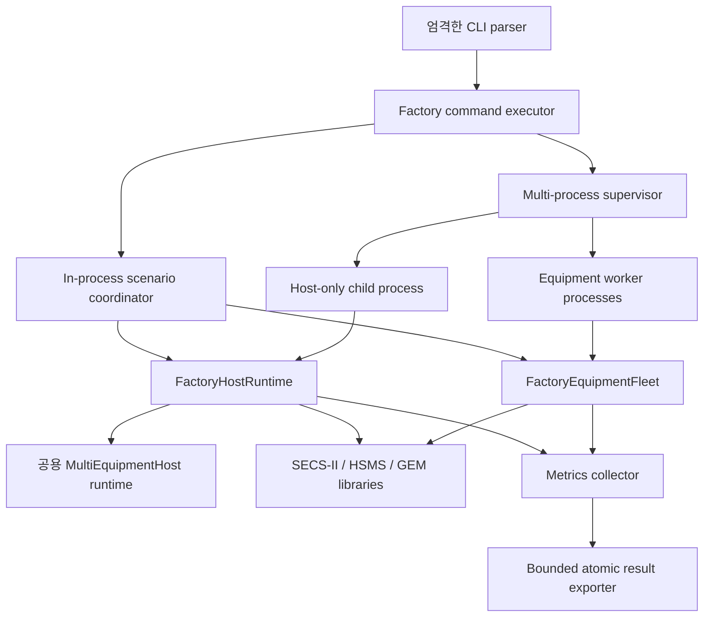

# Factory-Scale 아키텍처

## 범위와 증거 경계

`Dreamine.SecsGem.FactoryScale`은 다수의 실제 TCP loopback 연결에서 Dreamine SECS/GEM Host의 동작과 자원 정리를 관찰하는 headless Demo/Test 실행기다. 제품용 Equipment Simulator, SEMI 적합성 시험기, 외부 Simulator 또는 실제 장비와의 호환성 인증 도구가 아니다.

실행기는 배포되는 SECS/GEM 라이브러리 밖에 위치한다. 먼저 내부 orchestration을 검증하고, 그 결과만으로 Core public API나 NuGet API를 확대하지 않는다. 외부 Simulator는 자동 실행하지 않는다.

이 문서 집합은 다음 상태 용어를 사용한다.

| 상태 | 의미 |
|---|---|
| `Passed` | 명시한 환경에서 특정 실행의 모든 판정을 만족했다. 다른 환경이나 규모로 일반화할 수 없다. |
| `Experimental` | 소규모 엔지니어링 smoke에서 경로를 실행했다. Factory-scale 수용량 검증은 아니다. |
| `Pending` | 구현 또는 실행이 예정되어 있으며 유효한 결과가 아직 없다. |
| `Not Run` | 절차를 실행하지 않았다. |
| `Waiting for User` | 사람이 외부 peer를 설정·조작하고 증거를 기록해야 한다. |

실행 판정과 증거 성숙도는 서로 다른 축이다. JSON은 `Passed`, `Failed`, `Cancelled` 같은 실행 판정을 기록하고 문서는 성공한 실행에도 `Experimental` 성숙도를 별도로 붙일 수 있다. 따라서 “`Experimental` — run `Passed`”는 판정은 통과했지만 capacity 또는 release qualification 증거로 승격하지 않았다는 뜻이다.

현재 결과는 [FACTORY_SCALE_TEST_MATRIX.md](FACTORY_SCALE_TEST_MATRIX.md)에 기록한다. 보존된 자체 loopback 증거에서 in-process 100/250/500/1,000대 staged scale, Idle-1000 1시간, Normal-500 1시간, multi-process 250대/5-worker smoke, multi-process 500대/5-worker 중 100 endpoint reconnect가 모두 `Passed`였다. 20대/2-worker Host restart 실행도 모든 판정을 통과했지만 용량 증거가 아닌 `Experimental`로 유지한다. 6시간, 24시간, 외부 Simulator, 실제 장비 결과는 주장하지 않는다.

## 구성 요소

주요 책임 경계는 다음과 같다.

- **CLI**: 알려진 subcommand, scenario, `--name value` option만 허용한다. 알 수 없는 option, 중복 option, 값 누락, 범위 오류를 실행 전에 거부한다.
- **Scenario coordinator**: in-process 환경 구성, protocol 단계, scenario workload, 결정적 정리, 최종 결과를 관리한다.
- **Factory Host runtime**: 공용 `MultiEquipmentHost`를 사용하고, message 작업과 pending transaction에 유한한 허용량을 적용하며 Host·장비별 지표를 수집한다.
- **Equipment fleet**: 검증된 loopback port에서 Equipment 역할의 passive `HsmsSession`을 만든다. 지원하는 시험 message를 bounded receive queue를 통해 처리한다.
- **Process supervisor**: 실행기가 소유한 child process만 시작한다. `ArgumentList`, shell 비활성화, stdout/stderr 동시 drain, bounded wait, 소유 process tree kill fallback을 사용한다.
- **Metrics/export**: 실제 runtime·process counter를 수집하고 bounded queue를 거쳐 JSON을 atomic replace 방식으로 기록한다.

## 실행 모드

### In-process

Host와 합성 Equipment fleet가 한 process에서 실행된다. 빠른 회귀 시험에 적합하며 local reconnect, Host runtime 교체, in-process fault injection을 포함한 전체 local scenario coordinator를 사용할 수 있다. 양쪽 자원이 한 process metric에 포함되므로 Host-only process metric과 직접 비교하면 안 된다.

### Multi-process

Coordinator는 한 개 이상의 Equipment worker를 소유한다. worker 한 개는 1~100개의 passive Equipment session과 서로 겹치지 않는 검증된 port 구간을 소유한다. coordinator는 worker identity와 일치하는 ready record가 나온 뒤 endpoint manifest를 읽는다.

일반 multi-process scenario에서는 coordinator가 Host runtime도 소유한다. `host-restart`에서는 worker fleet를 유지한 채 Host-only OS child process 두 개를 순서대로 감독한다.

1. Host child 1이 연결·Select·baseline traffic을 완료하고 결과를 export한 뒤 Host 자원을 0으로 정리하고 정상 종료한다.
2. worker는 원격 연결 종료를 감지하고 disconnected passive session만 같은 endpoint에서 직렬화하여 다시 listen한다.
3. 새 heartbeat가 원래 worker PID와 endpoint를 유지한 채 `Listening`, connected socket 0을 보고해야 한다.
4. 다른 PID의 Host child 2가 시작되어 재연결·재Select·새 traffic·0 cleanup을 완료한다.
5. 두 Host 결과에서 모든 장비의 `ConnectionId`가 달라야 하고, cleanup 시 pending/control transaction이 0이어야 한다.

두 Host child 결과는 분리해서 보존한다. aggregate 결과의 단일 `Process` snapshot을 Host와 모든 worker process의 합계처럼 표시하지 않는다.

### Host-only

Host-only는 명시적인 endpoint manifest가 필요하다. 외부 Simulator를 시작하지 않는다. manifest endpoint에 연결하여 baseline protocol 확인, 증거 export, 모든 context 정리 후 종료한다.

### Equipment-only와 worker

Equipment-only는 독립 합성 fleet를 시작한다. worker는 multi-process coordinator가 감독하는 형태다. worker는 다음 순서로 자료를 publish한다.

1. endpoint manifest
2. ready record
3. 주기적 heartbeat
4. graceful stop 후 final result

Equipment-only는 duration 만료, Ctrl+C, 유효한 stop request 또는 parent 종료까지 유지된다. External Simulator나 실제 장비를 대체하는 증거로 사용하지 않는다.

## 격리 모델

장비마다 독립 `EquipmentConnectionContext`, `HsmsSession`, transaction manager, system-bytes generator, GEM runtime, `ConnectionId`를 사용한다. 동일한 Session ID나 동일한 System Bytes 값이 서로 다른 연결에 나타나도 connection identity로 격리한다. correlation을 전역 System Bytes만으로 수행하지 않는다.

재연결은 해당 장비 context만 교체한다. 한 장비의 timeout, callback 오류, socket 종료가 다른 장비의 session이나 transaction을 해제해서는 안 된다. Host restart에서는 process 경계를 새로 만들기 때문에 이전 process의 transaction, System Bytes 상태, `ConnectionId`를 상속하지 않는다.

## Port와 endpoint 소유권

Port 범위는 loopback 전용으로 검증하며 worker마다 겹치지 않게 분할한다. endpoint manifest에는 worker identity와 장비 definition이 포함된다. coordinator는 다음을 확인한다.

- control directory 밖의 manifest 경로를 허용하지 않는다.
- run ID, worker ID, PID, start index, count가 ready record 및 launch request와 일치해야 한다.
- 장비 ID, endpoint, definition의 중복과 count 불일치를 거부한다.
- stale control file을 현재 run의 준비 증거로 인정하지 않는다.

대규모 실행 전에는 요청한 port 수가 범위 안에 들어오는지와 다른 process가 port를 사용 중인지 운영자가 확인해야 한다.

## Bounded 실행 정책

| 자원 | 정책 |
|---|---|
| Connect / reconnect / message 작업 | 각각 독립 concurrency limit |
| Host message queue | bounded, accepted work는 대기하며 자동 유실하지 않음 |
| Equipment receive queue | bounded, synchronous callback은 대기하지 않고 명시적으로 `Reject`; reject를 계수하고 정상 scenario에서는 0을 요구 |
| 장비별·전역 pending transaction | 각각 semaphore admission limit |
| Diagnostic queue | bounded, 가득 차면 newest diagnostic을 버리고 drop count 증가 |
| Export queue | bounded, 순차 atomic file write |
| Child stdout/stderr evidence | line 수·전체 byte 수·line 길이를 제한한 tail만 보존 |
| Ready / heartbeat / shutdown / child completion | 모두 timeout이 있는 bounded wait |

Host message와 export는 bounded `Wait`를 사용한다. synchronous Equipment callback에서 capacity 대기는 ThreadPool 고갈을 만들 수 있으므로 Equipment receive queue는 명시적인 `Reject`를 사용하며 reject를 숨기지 않는다. 정상 scenario는 reject 0을 요구한다. Diagnostic만 선언된 drop-newest 정책으로 생략될 수 있고 모든 drop을 별도 계수한다. Diagnostic drop은 protocol message loss와 같은 뜻이 아니다.

## Worker 제어 protocol

Control file은 run별 control directory 아래 atomic write로 생성한다. ready, heartbeat, stop, result에는 run/worker/process identity가 들어간다. stop은 cooperative request가 우선이며, supervisor는 유한 시간 동안 정상 종료를 기다린다. 실패하면 자신이 시작한 process tree만 종료한다.

동시에 여러 caller가 dispose를 요청해도 하나의 cleanup completion을 기다려야 한다. worker 결과는 다음이 모두 만족될 때만 정상 cleanup으로 판정한다.

- tracked session, listener, operation, queue depth가 0
- worker process의 open socket이 0
- 정상 exit이며 kill fallback을 사용하지 않음
- result identity가 launch request 및 ready record와 일치

완전한 open-socket 0 합격 판정은 현재 Windows PID TCP table provider가 필요하다. 다른 플랫폼이거나 provider가 unavailable이면 값을 0으로 대체하지 않으며 multi-process worker cleanup은 실패로 판정한다. 다른 진단 명령은 실행할 수 있어도 qualified zero-socket evidence로 사용할 수 없다.

Parent process의 socket 수만 0이라는 이유로 worker cleanup을 성공으로 간주하지 않는다.

## Host restart의 passive 재수신

worker maintenance loop는 종료되지 않은 fleet에서 disconnected/faulted peer만 `RestartDisconnectedAsync`로 교체한다. 수명주기 gate로 maintenance, explicit restart, dispose가 경합하지 않게 한다. 같은 endpoint bind는 유한 횟수와 짧은 interval로 재시도한다. 종료가 시작되면 새 listener를 만들지 않는다.

heartbeat의 `Listening`은 실제로 모든 passive endpoint가 다시 listen 중일 때만 사용한다. worker는 Select 상태를 추측하지 않는다. Select 복원은 Host 결과의 connected/selected 수와 protocol traffic으로 판정한다.

## 지표와 결과

결과에는 최소한 다음 관측값이 들어간다.

- requested / connected / selected / failed / reconnecting 장비 수
- request / response / timeout / reconnect / failure / correlation 오류 수
- 송수신 byte와 rate
- response latency 평균, P50, P95, P99, 최소, 최대
- pending transaction과 queue depth/peak/drop
- reconnect/control/message 동시 작업 수와 peak
- process working set, managed heap, GC count, thread/handle, thread-pool, OS TCP 지표
- 장비별 `EquipmentId`, `ConnectionId`, 상태, request/response/timeout, latency

Multi-process에서는 Host와 worker별 result 및 cleanup check를 분리해서 보존한다. 서로 다른 process의 순간값을 단일 process snapshot에 덮어쓰거나 의미 없는 합계로 만들지 않는다. 합계가 필요한 logical count는 aggregate임을 명시한다.

Forced GC 전 cleanup snapshot을 1차 판정 근거로 사용한다. forced GC 후 snapshot은 보충 관측값이며, 명시적인 dispose 실패를 가리는 용도로 사용하지 않는다.

## 검증된 증거 기준선

다음 결과는 Release 실행 JSON과 checkpoint를 읽기 전용으로 검토한 값이다. Raw JSON, periodic snapshot, process control file, log는 committed source 밖에 보관하며 이 저장소에 포함하지 않는다.

| 증거 | 모드 | 범위 | 결과 |
|---|---|---|---|
| Staged scale | In-process | 100 / 250 / 500 / 1,000대 | 각 단계 `Passed`; 전 장비 Selected, timeout/failure/correlation error 0, 결정적 cleanup 자원과 OS socket 0 |
| Multi-process smoke | Multi-process | 250대 / 5 workers | `Passed`; Host application pair 502/502, 5개 worker 모두 session/listener/operation/queue/socket 0으로 정상 종료 |
| Multi-process reconnect | Multi-process | 500대 / 5 workers, 100 endpoint restart | `Passed`; reconnect 100/100, peak 16/16, unaffected traffic 정상, Host와 5개 worker cleanup 0 |
| Host OS process restart | Multi-process | 20대 / 유지된 2 workers | `Experimental` — `Passed`; 서로 다른 두 Host PID, 모든 ConnectionId 교체, 두 Host 통신 및 cleanup 0 |
| 1시간 idle | In-process | 1,000대 | `Passed`; 1,000/1,000 Selected, baseline 포함 Linktest exchange 62,000, timeout/failure/correlation error 0 |
| 1시간 normal | In-process | 500대 | `Passed`; 전체 application pair 1,800,999, 평균 2.4885078757400754 ms, P95 15.02 ms, P99 15.62 ms |
| Busy / trace / large / fault / reconnect | In-process | 성능 문서의 정확한 profile | `Passed`; fault의 주입된 timeout/failure는 기대 결과로 명시적으로 격리됨 |

`requestsPerSecond`는 application Primary/pair rate다. `messagesPerSecond`는 `requestsPerSecond + responsesPerSecond`이며 정상 1:1 응답에서는 pair당 두 개의 SECS data message를 센다. Select, Linktest 같은 HSMS control frame은 이 논리 message counter에서 제외되지만 frame byte와 pending-control 지표에는 포함된다. 따라서 idle checkpoint에서 `messagesPerSecond = 0`이고 byte rate는 0이 아닌 것이 정상이다.

현재 실행기는 sustained workload profile의 final 결과에 마지막 non-zero interval rate를 보존한다. WPF result reader는 즉시 연속된 terminal no-delta snapshot 때문에 final rate가 0이었던 기존 보존 JSON도 fallback 해석한다. 그래도 final total, interval rate, evidence schema/build를 함께 확인해야 한다.

검증된 모든 scenario cleanup에서 tracked session/listener, current pending/control/reconnect operation, business queue depth, Factory-owned scenario worker, process-owned socket이 0으로 돌아왔다. Working set, managed heap, thread, handle은 0-cleanup gate가 아니라 별도 process 관측값이다. Idle-1000은 process 시작 대비 forced-GC 후에도 WS +41,271,296 bytes, heap +5,185,816 bytes, thread +30, handle +240 residual이 있었다. 반복 실행으로 관찰할 값이며 단일 실행만으로 leak 또는 leak-free를 단정하면 안 된다.

검증 기준선에는 FactoryScale test 42/42, WPF integration test 19/19, SECS/GEM Core test 222개 통과도 포함된다. 전체 solution test는 664개 통과와 이미 알려진 Ontology 실패 1개를 기록했고, FactoryScale과 WPF Release build는 모두 warning 0, error 0으로 완료됐다. FactoryScale은 non-packable이며 public SECS/GEM Core 또는 NuGet API를 변경하지 않았다.

## 현재 경계

- Multi-process remote fault behavior를 바꾸는 command/ack IPC는 구현 범위 밖이다. 따라서 multi-process `fault-isolation`을 실행 없이 성공으로 표시하지 않는다.
- In-process fault injection과 OS process 격리는 서로 다른 증거다.
- 20대/2-worker multi-process Host restart는 실행 판정은 통과했지만 경로 확인용 `Experimental`이며 factory capacity 증거가 아니다.
- 6시간과 24시간 duration tier는 `Not Run`이다.
- External Simulator 및 Real Equipment 검증은 `Not Run / Waiting for User`다.
- 결과는 자체 구현의 회귀·용량 관찰 자료이며 SEMI compliance certificate가 아니다.
- FactoryScale은 public Core/NuGet API나 배포 package version을 변경하지 않는다.

운영 절차는 [FACTORY_SCALE_OPERATIONS_KO.md](FACTORY_SCALE_OPERATIONS_KO.md), 시험 상태는 [FACTORY_SCALE_TEST_MATRIX.md](FACTORY_SCALE_TEST_MATRIX.md), 성능과 soak 판정 기준은 각각 [FACTORY_SCALE_PERFORMANCE.md](FACTORY_SCALE_PERFORMANCE.md), [FACTORY_SCALE_SOAK.md](FACTORY_SCALE_SOAK.md)를 따른다.
