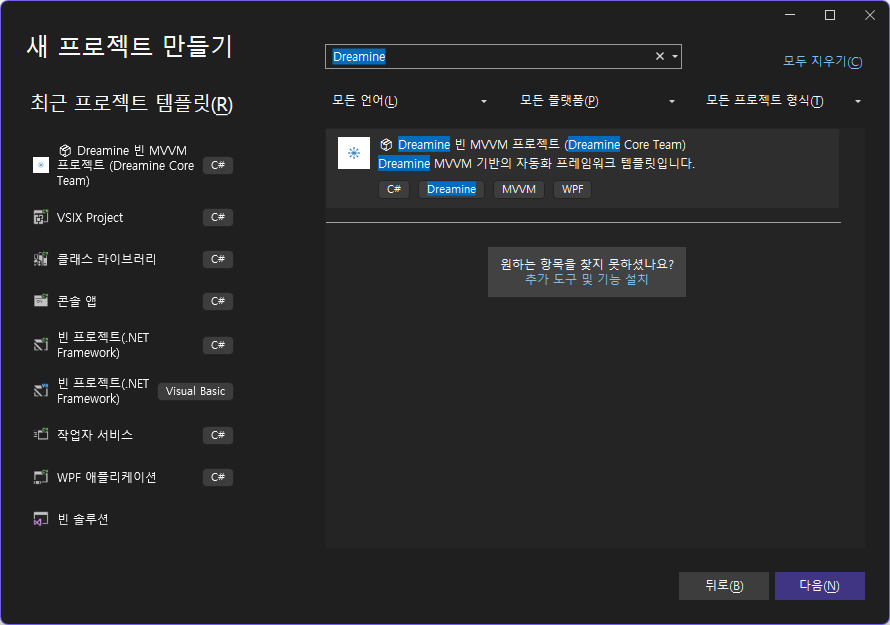

# 📄 Dreamine.MVVM.Behaviors - WindowDragBehavior

This module is a refactored implementation of Microsoft's [XamlBehaviors for WPF](https://github.com/microsoft/XamlBehaviorsWpf) adapted to the internal structure of Dreamine.

---

## 🔍 Original Source & License

- Source: https://github.com/microsoft/XamlBehaviorsWpf  
- License: MIT License (see below)

---

## 📜 MIT License Notice

> Copyright (c) Microsoft  
> Permission is hereby granted, free of charge, to any person obtaining a copy  
> of this software and associated documentation files (the "Software"), to deal  
> in the Software without restriction, including without limitation the rights  
> to use, copy, modify, merge, publish, distribute, sublicense, and/or sell  
> copies of the Software, and to permit persons to whom the Software is  
> furnished to do so, subject to the following conditions:
> 
> The above copyright notice and this permission notice shall be included in  
> all copies or substantial portions of the Software.
> 
> THE SOFTWARE IS PROVIDED "AS IS", WITHOUT WARRANTY OF ANY KIND...

---

## ✍️ Refactoring Summary

- **Namespace Change**  
  ↳ Microsoft.Xaml.Behaviors → Dreamine.MVVM.Behaviors  
  ↳ Removed external namespaces and integrated into Dreamine structure

- **Internal Structure Optimization**  
  ↳ Removed unnecessary external references  
  ↳ Reorganized class/method definitions based on Dreamine coding convention

- **Dependency Reduction**  
  ↳ Removed NuGet dependency and ensured internal modular operation

- **📘 Doxygen-style Comments with Korean Intentions**  
  ↳ Applied structured Korean technical documentation for future developers

---

## 🛠️ Dreamine Build & Template Automation Tools

The Dreamine project includes automation scripts to increase development productivity.

### 🔹 `./CleanFile.bat`
- Cleans up all `bin/`, `obj/`, `.vs/`, and `*.bak` files.
- Also removes NuGet caches and Visual Studio configuration cache.

### 🔹 `./Dreamine/.Templates/Dreamine.MVVM.Template/rebuild_template.bat`
- Builds the template `.csproj` and generates `.nupkg`
- Uninstalls the previous template and installs the updated one
- Refreshes the Visual Studio template cache  
- You will see the following template selection UI:



### 🔹 `./Dreamine/Library/build-nuget.bat`
- Builds and packages all Dreamine NuGet modules
- Optionally pushes to NuGet.org (API Key required)

---

## 📦 Output Directory

All generated `.nupkg` files are stored in:

```
Dreamine\LocalPackages\
```

You can install them manually via `dotnet new install` or publish using `dotnet nuget push`.
