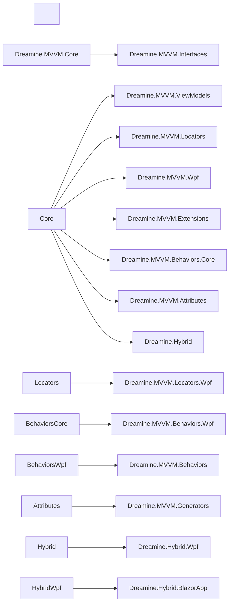

\# Dreamine.MVVM.FullKit


All-in-One package set for building WPF MVVM applications with the Dreamine architecture.


> Dreamine.MVVM.FullKit is a meta-package/repository concept that brings together the core Dreamine MVVM modules used for WPF applications: DI, ViewModel infrastructure, source generators, locator wiring, WPF runtime integration, behaviors, extensions, and optional hybrid hosting.

[➡️ 한국어 문서 보기](README_ko.md)

---


\## Overview


Dreamine.MVVM.FullKit is designed for developers who want a lightweight but explicit MVVM stack for WPF.


This kit brings together:


\- \*\*Dreamine.MVVM.Core\*\*  

&nbsp; Core container and runtime infrastructure centered on `DMContainer`.


\- \*\*Dreamine.MVVM.Interfaces\*\*  

&nbsp; Shared contracts for navigation, resolver abstraction, event base patterns, and MVVM interaction boundaries.


\- \*\*Dreamine.MVVM.ViewModels\*\*  

&nbsp; Base ViewModel types and fundamental MVVM runtime support.


\- \*\*Dreamine.MVVM.Attributes\*\*  

&nbsp; Declarative attributes such as `DreamineProperty` and command-related attributes used by generators.


\- \*\*Dreamine.MVVM.Generators\*\*  

&nbsp; Roslyn source generators that reduce boilerplate by generating MVVM code automatically.


\- \*\*Dreamine.MVVM.Locators\*\*  

&nbsp; Naming-convention and resolver-based View ↔ ViewModel connection infrastructure.


\- \*\*Dreamine.MVVM.Locators.Wpf\*\*  

&nbsp; WPF-specific auto-wiring support such as DataContext connection and binder integration.


\- \*\*Dreamine.MVVM.Wpf\*\*  

&nbsp; WPF runtime bootstrap layer centered on `DreamineAppBuilder`.


\- \*\*Dreamine.MVVM.Behaviors.Core\*\*  

&nbsp; Base behavior abstraction infrastructure.


\- \*\*Dreamine.MVVM.Behaviors.Wpf\*\*  

&nbsp; WPF behavior execution/runtime layer.


\- \*\*Dreamine.MVVM.Behaviors\*\*  

&nbsp; Ready-to-use MVVM-friendly behaviors such as EnterKey and focus helpers.


\- \*\*Dreamine.MVVM.Extensions\*\*  

&nbsp; Utility helpers and extension points used across Dreamine MVVM applications.


\- \*\*Dreamine.Hybrid / Dreamine.Hybrid.Wpf / Dreamine.Hybrid.BlazorApp\*\*  

&nbsp; Optional hybrid hosting stack for embedding Blazor UI inside WPF.


---


\## Why FullKit exists


Many MVVM projects become fragmented because infrastructure, generator setup, locator rules, and WPF runtime glue are introduced independently.


Dreamine.MVVM.FullKit exists to provide a unified starting point with these goals:


\- reduce startup complexity

\- keep architecture explicit

\- separate platform-neutral and platform-specific responsibilities

\- support testable, DI-friendly ViewModel design

\- remove repetitive MVVM boilerplate through source generation

\- keep WPF runtime concerns out of platform-neutral packages


---


\## Architecture Summary





---


\## Main Features


\### 1. Lightweight DI container


`DMContainer` provides the lightweight registration and resolution model used by Dreamine.


Typical use cases:


\- singleton registration

\- factory-based registration

\- constructor injection

\- explicit runtime ownership


This keeps the container simple and predictable for WPF applications.


\### 2. Source-generated MVVM boilerplate


Dreamine reduces repetitive code by combining:


\- attributes

\- Roslyn source generators

\- generated property notification code

\- generated command wiring


This allows ViewModels to stay focused on state and behavior instead of plumbing.


\### 3. Convention-based ViewModel resolution


Dreamine uses View ↔ ViewModel mapping conventions with extension points for custom resolvers.


Typical pattern:


\- `Views.MainWindow` → `ViewModels.MainWindowViewModel`

\- explicit registration when convention is not enough

\- optional automatic DataContext assignment in WPF


\### 4. WPF runtime bootstrap


`DreamineAppBuilder` is the WPF bootstrap entry point.


It is responsible for:


\- initializing Dreamine runtime for WPF

\- registering View ↔ ViewModel mappings

\- auto-registering types into `DMContainer`

\- attaching `DataContext` at runtime when configured


\### 5. WPF Behaviors


Dreamine behaviors help keep interaction logic out of code-behind.


Examples:


\- Enter key → command execution

\- focus on load

\- drag behaviors

\- attached interaction helpers


\### 6. Optional WPF + Blazor hybrid hosting


For applications that need a hybrid UI model, Dreamine provides:


\- WPF hosting control

\- Blazor root component hosting

\- service wiring

\- message bus style integration between shell and hosted UI


---


\## Recommended Package Composition


A typical WPF project may use this composition:


```xml

<ItemGroup>

&nbsp; <PackageReference Include="Dreamine.MVVM.Core" Version="\*" />

&nbsp; <PackageReference Include="Dreamine.MVVM.Interfaces" Version="\*" />

&nbsp; <PackageReference Include="Dreamine.MVVM.ViewModels" Version="\*" />

&nbsp; <PackageReference Include="Dreamine.MVVM.Attributes" Version="\*" />

&nbsp; <PackageReference Include="Dreamine.MVVM.Generators" Version="\*" OutputItemType="Analyzer" ReferenceOutputAssembly="false" />

&nbsp; <PackageReference Include="Dreamine.MVVM.Locators" Version="\*" />

&nbsp; <PackageReference Include="Dreamine.MVVM.Locators.Wpf" Version="\*" />

&nbsp; <PackageReference Include="Dreamine.MVVM.Wpf" Version="\*" />

&nbsp; <PackageReference Include="Dreamine.MVVM.Behaviors" Version="\*" />

&nbsp; <PackageReference Include="Dreamine.MVVM.Extensions" Version="\*" />

</ItemGroup>

```


For hybrid hosting:


```xml

<ItemGroup>

&nbsp; <PackageReference Include="Dreamine.Hybrid" Version="\*" />

&nbsp; <PackageReference Include="Dreamine.Hybrid.Wpf" Version="\*" />

&nbsp; <PackageReference Include="Dreamine.Hybrid.BlazorApp" Version="\*" />

</ItemGroup>

```


---


\## Quick Start


\### 1. Initialize WPF runtime


In `App.xaml.cs`:


```csharp

using System.Reflection;

using System.Windows;

using Dreamine.MVVM.Wpf;


namespace SampleApp;


/// <summary>

/// Application bootstrap.

/// </summary>

public partial class App : Application

{

&nbsp;   /// <summary>

&nbsp;   /// Handles application startup.

&nbsp;   /// </summary>

&nbsp;   protected override void OnStartup(StartupEventArgs e)

&nbsp;   {

&nbsp;       base.OnStartup(e);


&nbsp;       DreamineAppBuilder.Initialize(Assembly.GetExecutingAssembly());

&nbsp;   }

}

```


\### 2. Create a ViewModel


```csharp

using Dreamine.MVVM.Attributes;

using Dreamine.MVVM.ViewModels;


namespace SampleApp.ViewModels;


/// <summary>

/// Main window ViewModel.

/// </summary>

public partial class MainWindowViewModel : ViewModelBase

{

&nbsp;   \[DreamineProperty]

&nbsp;   private string \_title = "Dreamine FullKit";


&nbsp;   \[RelayCommand]

&nbsp;   private void ChangeTitle()

&nbsp;   {

&nbsp;       Title = "Updated";

&nbsp;   }

}

```


\### 3. Bind View to ViewModel automatically


```xml

<Window x:Class="SampleApp.Views.MainWindow"

&nbsp;       xmlns="http://schemas.microsoft.com/winfx/2006/xaml/presentation"

&nbsp;       xmlns:x="http://schemas.microsoft.com/winfx/2006/xaml"

&nbsp;       xmlns:locator="clr-namespace:Dreamine.MVVM.Locators.Wpf;assembly=Dreamine.MVVM.Locators.Wpf"

&nbsp;       locator:ViewModelBinder.AutoWireViewModel="True">

&nbsp;   <Grid>

&nbsp;       <StackPanel>

&nbsp;           <TextBlock Text="{Binding Title}" />

&nbsp;           <Button Content="Change"

&nbsp;                   Command="{Binding ChangeTitleCommand}" />

&nbsp;       </StackPanel>

&nbsp;   </Grid>

</Window>

```


---


\## When to use FullKit


Use FullKit when:


\- you want a consistent Dreamine-based WPF MVVM starting point

\- you want explicit architecture instead of hidden framework magic

\- you want generator-based productivity without a heavy runtime

\- you want clear separation between platform-neutral and WPF-specific layers

\- you want optional hybrid expansion later


Do not use FullKit as a blind dependency bundle. Select only the modules that your application actually needs.


---


\## Responsibility Boundaries


Recommended boundaries:


\- \*\*Core\*\*: container and fundamental infrastructure

\- \*\*Interfaces\*\*: contracts only

\- \*\*ViewModels\*\*: UI state and interaction logic

\- \*\*Locators\*\*: View ↔ ViewModel connection rules

\- \*\*Wpf\*\*: runtime bootstrap and WPF-specific binding glue

\- \*\*Behaviors\*\*: reusable UI interaction units

\- \*\*Hybrid\*\*: WPF + Blazor integration only when needed


This separation keeps lower layers independent from upper layers.


---


\## Suggested Repository Layout


```text

Dreamine.MVVM.FullKit/

├─ README.md

├─ README\_KO.md

├─ LICENSE

├─ src/

│  ├─ Dreamine.MVVM.Core/

│  ├─ Dreamine.MVVM.Interfaces/

│  ├─ Dreamine.MVVM.ViewModels/

│  ├─ Dreamine.MVVM.Attributes/

│  ├─ Dreamine.MVVM.Generators/

│  ├─ Dreamine.MVVM.Locators/

│  ├─ Dreamine.MVVM.Locators.Wpf/

│  ├─ Dreamine.MVVM.Wpf/

│  ├─ Dreamine.MVVM.Behaviors.Core/

│  ├─ Dreamine.MVVM.Behaviors.Wpf/

│  ├─ Dreamine.MVVM.Behaviors/

│  ├─ Dreamine.MVVM.Extensions/

│  ├─ Dreamine.Hybrid/

│  ├─ Dreamine.Hybrid.Wpf/

│  └─ Dreamine.Hybrid.BlazorApp/

└─ samples/

```


---


\## License


MIT License


---


\## Notes


This README is a synthesized FullKit-level document built from the current Dreamine repositories and their package-level documentation so that the FullKit repository can expose a unified entry document.


