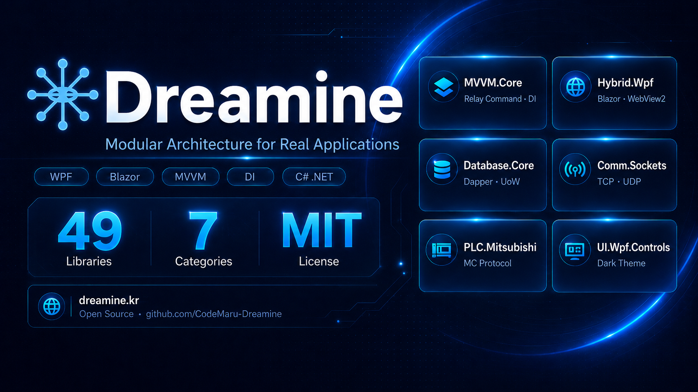
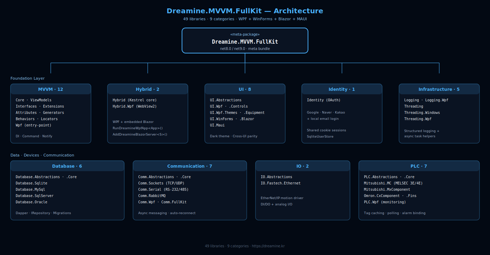
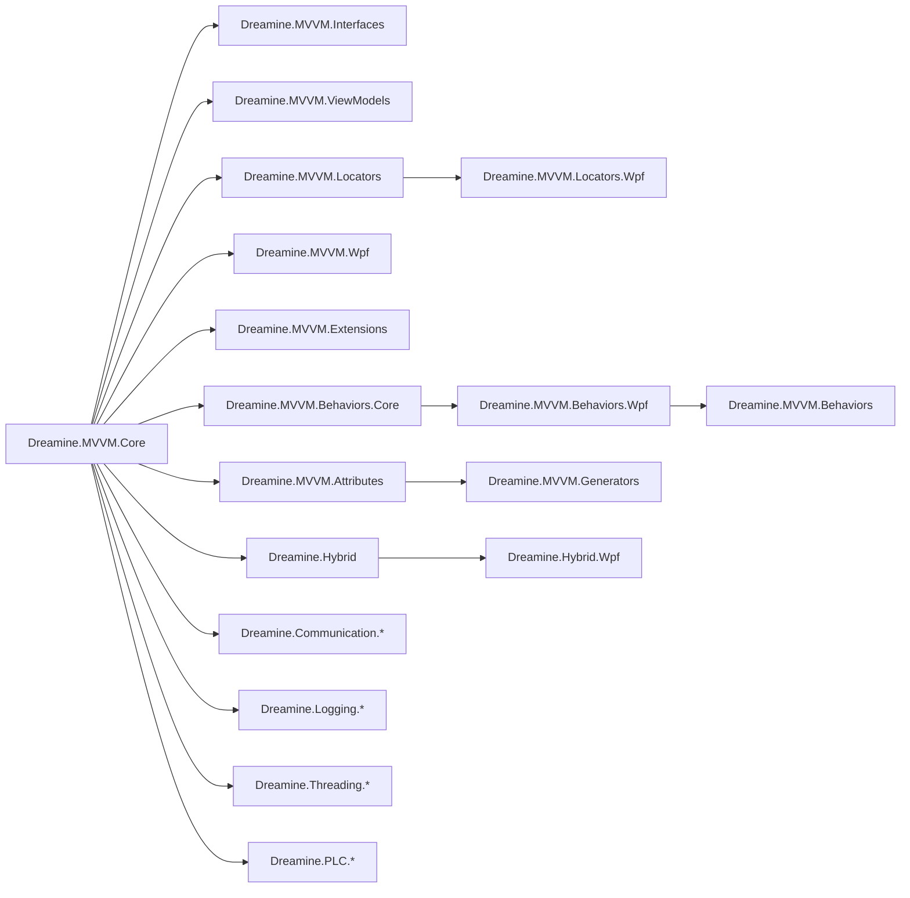

# Dreamine.MVVM.FullKit

[](https://github.com/CodeMaru-Dreamine/Dreamine.MVVM.FullKit/actions/workflows/ci.yml)


[](https://www.nuget.org/packages/Dreamine.MVVM.FullKit)
[](https://www.nuget.org/packages/Dreamine.MVVM.FullKit)
[](https://dreamine.kr/libraries)
[](https://dreamine.kr/guide)
[](https://dreamine.kr/playground)
[](https://bookk.co.kr/bookStore/69c0f1b41461ec1ae849a0f6)

All-in-One package set for building WPF MVVM applications with the Dreamine architecture.

> Dreamine.MVVM.FullKit is a meta-package/repository concept that brings together the core Dreamine MVVM modules used for WPF applications: DI, ViewModel infrastructure, source generators, locator wiring, WPF runtime integration, behaviors, extensions, and optional hybrid hosting.

[➡️ 한국어 문서 보기](./README_KO.md)



## Architecture at a Glance



The FullKit meta-package bundles **49 libraries** across **9 architectural categories** — from MVVM foundation to UI, hosting, identity, data access, communication, I/O, and PLC drivers. Every category has an entry-point package you can add à la carte, or grab everything through the FullKit bundle.

---

## Repository Quick Start

This repository uses Git submodules for the individual Dreamine libraries. Clone it recursively:

```powershell
git clone --recursive https://github.com/CodeMaru-Dreamine/Dreamine.MVVM.FullKit.git
cd Dreamine.MVVM.FullKit
```

If you already cloned the repository without submodules:

```powershell
git submodule update --init --recursive
```

Recommended first verification:

```powershell
dotnet restore "20_SOURCES/200. Tests/Dreamine.FullKit.Tests/Dreamine.FullKit.Tests.csproj"
dotnet test "20_SOURCES/200. Tests/Dreamine.FullKit.Tests/Dreamine.FullKit.Tests.csproj" --no-restore
dotnet test "20_SOURCES/200. Tests/Dreamine.FullKit.Wpf.Tests/Dreamine.FullKit.Wpf.Tests.csproj" --no-restore
```

Representative samples:

```powershell
dotnet build "20_SOURCES/998. DEMO/000. Sample/010. Wpfs/SampleCore/SampleCore.csproj" --configuration Release
dotnet build "20_SOURCES/998. DEMO/000. Sample/050. CrossUi/SampleCrossUi.Wpf/SampleCrossUi.Wpf.csproj" --configuration Release
```

The CI workflow runs on Windows and checks the core tests, WPF tests, WinForms tests, and representative samples.

For contribution and submodule workflow details, see [CONTRIBUTING.md](./CONTRIBUTING.md) and [docs/submodules.md](./docs/submodules.md).

---

## Overview

Dreamine.MVVM.FullKit is designed for developers who want a lightweight but explicit MVVM stack for WPF.

This kit brings together:

- **Dreamine.MVVM.Core**  
  Core container and runtime infrastructure centered on `DMContainer`.

- **Dreamine.MVVM.Interfaces**  
  Shared contracts for navigation, resolver abstraction, event base patterns, and MVVM interaction boundaries.

- **Dreamine.MVVM.ViewModels**  
  Base ViewModel types and fundamental MVVM runtime support.

- **Dreamine.MVVM.Attributes**  
  Declarative attributes such as `DreamineProperty` and command-related attributes used by generators.

- **Dreamine.MVVM.Generators**  
  Roslyn source generators that reduce boilerplate by generating MVVM code automatically.

- **Dreamine.MVVM.Locators**  
  Naming-convention and resolver-based View ↔ ViewModel connection infrastructure.

- **Dreamine.MVVM.Locators.Wpf**  
  WPF-specific auto-wiring support such as DataContext connection and binder integration.

- **Dreamine.MVVM.Wpf**  
  WPF runtime bootstrap layer centered on `DreamineAppBuilder`.

- **Dreamine.MVVM.Behaviors.Core**  
  Base behavior abstraction infrastructure.

- **Dreamine.MVVM.Behaviors.Wpf**  
  WPF behavior execution/runtime layer.

- **Dreamine.MVVM.Behaviors**  
  Ready-to-use MVVM-friendly behaviors such as EnterKey and focus helpers.

- **Dreamine.MVVM.Extensions**  
  Utility helpers and extension points used across Dreamine MVVM applications.

- **Dreamine.Hybrid / Dreamine.Hybrid.Wpf**  
  Optional hybrid hosting stack for sharing messages/state and embedding Blazor UI inside WPF.

- **Dreamine.Communication.\***  
  Communication abstractions and TCP/UDP, serial, RabbitMQ, WPF, and FullKit composition packages.

- **Dreamine.Logging / Dreamine.Logging.Wpf**  
  Logging infrastructure and WPF integration packages.

- **Dreamine.Threading / Dreamine.Threading.Windows / Dreamine.Threading.Wpf**  
  Threading and dispatcher helper packages.

- **Dreamine.PLC.\***  
  PLC abstractions, simulator/runtime support, Mitsubishi MC/MX Component, Omron FINS/CX-Compolet, and WPF monitor packages.

---

## Why FullKit exists

Many MVVM projects become fragmented because infrastructure, generator setup, locator rules, and WPF runtime glue are introduced independently.

Dreamine.MVVM.FullKit exists to provide a unified starting point with these goals:

- reduce startup complexity
- keep architecture explicit
- separate platform-neutral and platform-specific responsibilities
- support testable, DI-friendly ViewModel design
- remove repetitive MVVM boilerplate through source generation
- keep WPF runtime concerns out of platform-neutral packages

---

## Architecture Summary



---

## Main Features

### 1. Lightweight DI container

`DMContainer` provides the lightweight registration and resolution model used by Dreamine.

Typical use cases:

- singleton registration
- factory-based registration
- constructor injection
- explicit runtime ownership

This keeps the container simple and predictable for WPF applications.

### 2. Source-generated MVVM boilerplate

Dreamine reduces repetitive code by combining:

- attributes
- Roslyn source generators
- generated property notification code
- generated command wiring

This allows ViewModels to stay focused on state and behavior instead of plumbing.

### 3. Convention-based ViewModel resolution

Dreamine uses View ↔ ViewModel mapping conventions with extension points for custom resolvers.

Typical pattern:

- `Views.MainWindow` → `ViewModels.MainWindowViewModel`
- explicit registration when convention is not enough
- optional automatic DataContext assignment in WPF

### 4. WPF runtime bootstrap

`DreamineAppBuilder` is the WPF bootstrap entry point.

It is responsible for:

- initializing Dreamine runtime for WPF
- registering View ↔ ViewModel mappings
- auto-registering types into `DMContainer`
- attaching `DataContext` at runtime when configured

### 5. WPF Behaviors

Dreamine behaviors help keep interaction logic out of code-behind.

Examples:

- Enter key → command execution
- focus on load
- drag behaviors
- attached interaction helpers

### 6. Optional WPF + Blazor hybrid hosting

For applications that need a hybrid UI model, Dreamine provides:

- WPF hosting control
- Blazor root component hosting
- service wiring
- message bus style integration between shell and hosted UI

---

## Recommended Package Composition

A typical WPF project may use this composition:

```xml
<ItemGroup>
  <PackageReference Include="Dreamine.MVVM.Core" Version="*" />
  <PackageReference Include="Dreamine.MVVM.Interfaces" Version="*" />
  <PackageReference Include="Dreamine.MVVM.ViewModels" Version="*" />
  <PackageReference Include="Dreamine.MVVM.Attributes" Version="*" />
  <PackageReference Include="Dreamine.MVVM.Generators" Version="*" OutputItemType="Analyzer" ReferenceOutputAssembly="false" />
  <PackageReference Include="Dreamine.MVVM.Locators" Version="*" />
  <PackageReference Include="Dreamine.MVVM.Locators.Wpf" Version="*" />
  <PackageReference Include="Dreamine.MVVM.Wpf" Version="*" />
  <PackageReference Include="Dreamine.MVVM.Behaviors" Version="*" />
  <PackageReference Include="Dreamine.MVVM.Extensions" Version="*" />
</ItemGroup>
```

For hybrid hosting:

```xml
<ItemGroup>
  <PackageReference Include="Dreamine.Hybrid" Version="*" />
  <PackageReference Include="Dreamine.Hybrid.Wpf" Version="*" />
</ItemGroup>
```

---

## Quick Start

### 1. Initialize WPF runtime

In `App.xaml.cs`:

```csharp
using System.Reflection;
using System.Windows;
using Dreamine.MVVM.Wpf;

namespace SampleApp;

/// <summary>
/// Application bootstrap.
/// </summary>
public partial class App : Application
{
    /// <summary>
    /// Handles application startup.
    /// </summary>
    protected override void OnStartup(StartupEventArgs e)
    {
        base.OnStartup(e);

        DreamineAppBuilder.Initialize(Assembly.GetExecutingAssembly());
    }
}
```

### 2. Create a ViewModel

```csharp
using Dreamine.MVVM.Attributes;
using Dreamine.MVVM.ViewModels;

namespace SampleApp.ViewModels;

/// <summary>
/// Main window ViewModel.
/// </summary>
public partial class MainWindowViewModel : ViewModelBase
{
    [DreamineProperty]
    private string _title = "Dreamine FullKit";

    [RelayCommand]
    private void ChangeTitle()
    {
        Title = "Updated";
    }
}
```

### 3. Bind View to ViewModel automatically

```xml
<Window x:Class="SampleApp.Views.MainWindow"
        xmlns="http://schemas.microsoft.com/winfx/2006/xaml/presentation"
        xmlns:x="http://schemas.microsoft.com/winfx/2006/xaml"
        xmlns:locator="clr-namespace:Dreamine.MVVM.Locators.Wpf;assembly=Dreamine.MVVM.Locators.Wpf"
        locator:ViewModelBinder.AutoWireViewModel="True">
    <Grid>
        <StackPanel>
            <TextBlock Text="{Binding Title}" />
            <Button Content="Change"
                    Command="{Binding ChangeTitleCommand}" />
        </StackPanel>
    </Grid>
</Window>
```

---

## When to use FullKit

Use FullKit when:

- you want a consistent Dreamine-based WPF MVVM starting point
- you want explicit architecture instead of hidden framework magic
- you want generator-based productivity without a heavy runtime
- you want clear separation between platform-neutral and WPF-specific layers
- you want optional hybrid expansion later

Do not use FullKit as a blind dependency bundle. Select only the modules that your application actually needs.

---

## Responsibility Boundaries

Recommended boundaries:

- **Core**: container and fundamental infrastructure
- **Interfaces**: contracts only
- **ViewModels**: UI state and interaction logic
- **Locators**: View ↔ ViewModel connection rules
- **Wpf**: runtime bootstrap and WPF-specific binding glue
- **Behaviors**: reusable UI interaction units
- **Hybrid**: WPF + Blazor integration only when needed

This separation keeps lower layers independent from upper layers.

---

## Suggested Repository Layout

```text
Dreamine.MVVM.FullKit/
├─ README.md
├─ README_KO.md
├─ LICENSE
└─ 20_SOURCES/
   ├─ 100. Library/
   │  ├─ Core/
   │  ├─ Interfaces/
   │  ├─ ViewModels/
   │  ├─ Attributes/
   │  ├─ Generators/
   │  ├─ Locators/
   │  ├─ Locators.Wpf/
   │  ├─ Wpf/
   │  ├─ Behaviors.Core/
   │  ├─ Behaviors.Wpf/
   │  ├─ Behaviors/
   │  ├─ Extensions/
   │  ├─ Hybrid/
   │  ├─ Hybrid.Wpf/
   │  ├─ Communication.*
   │  ├─ Logging.*
   │  ├─ Threading.*
   │  └─ PLC.*
   └─ 998. DEMO/
      └─ 000. Sample/
```

---

## License

MIT License

---

## Notes

This README is a synthesized FullKit-level document built from the current Dreamine repositories and their package-level documentation so that the FullKit repository can expose a unified entry document.
