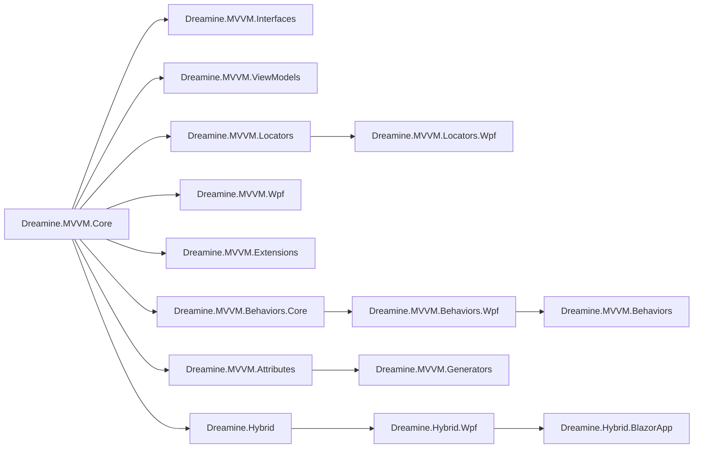

# Dreamine.MVVM.FullKit

WPF MVVM 애플리케이션을 위한 Dreamine 통합 패키지 문서입니다.

> Dreamine.MVVM.FullKit은 WPF 애플리케이션에 필요한 Dreamine MVVM 계열 모듈들을 한 번에 이해할 수 있도록 정리한 통합 문서입니다. DI, ViewModel 인프라, 소스 제너레이터, Locator, WPF 런타임 연결, Behavior, Extension, 그리고 선택적 Hybrid 호스팅까지 포함합니다.

[➡️ English Version](./README.md)

---

## 개요

Dreamine.MVVM.FullKit은 가볍지만 구조가 명확한 WPF MVVM 스택을 원하는 개발자를 위한 구성입니다.

이 문서가 다루는 주요 모듈은 다음과 같습니다.

- **Dreamine.MVVM.Core**  
  `DMContainer` 중심의 코어 컨테이너 및 런타임 인프라

- **Dreamine.MVVM.Interfaces**  
  네비게이션, 리졸버, 이벤트 기반 확장 지점 등 공통 계약 정의

- **Dreamine.MVVM.ViewModels**  
  ViewModel 기본 클래스와 MVVM 런타임 기반 구조

- **Dreamine.MVVM.Attributes**  
  `DreamineProperty`, 커맨드 관련 특성 등 선언형 특성 모듈

- **Dreamine.MVVM.Generators**  
  반복 코드를 줄이기 위한 Roslyn 소스 제너레이터

- **Dreamine.MVVM.Locators**  
  View ↔ ViewModel 연결 규칙 및 리졸버 기반 인프라

- **Dreamine.MVVM.Locators.Wpf**  
  WPF용 DataContext 자동 연결과 바인더 지원

- **Dreamine.MVVM.Wpf**  
  `DreamineAppBuilder` 중심의 WPF 부트스트랩 계층

- **Dreamine.MVVM.Behaviors.Core**  
  Behavior 기반 추상 인프라

- **Dreamine.MVVM.Behaviors.Wpf**  
  WPF Behavior 실행 레이어

- **Dreamine.MVVM.Behaviors**  
  EnterKey, FocusOnLoaded 등 실사용 Behavior 모듈

- **Dreamine.MVVM.Extensions**  
  Dreamine MVVM 애플리케이션 전반에서 사용하는 유틸리티 확장 모듈

- **Dreamine.Hybrid / Dreamine.Hybrid.Wpf / Dreamine.Hybrid.BlazorApp**  
  WPF 내부에 Blazor UI를 호스팅하기 위한 선택형 하이브리드 구성

---

## FullKit이 필요한 이유

MVVM 프로젝트는 보통 다음 이유로 구조가 흐트러집니다.

- DI 설정이 따로 놀음
- ViewModel 연결 규칙이 문서화되지 않음
- WPF 런타임 glue 코드가 여기저기 퍼짐
- 제너레이터와 런타임 계층의 책임이 섞임

Dreamine.MVVM.FullKit은 이 문제를 줄이기 위해 다음 목표를 가집니다.

- 시작 구성을 단순화한다
- 구조를 명시적으로 유지한다
- 플랫폼 중립 계층과 WPF 전용 계층을 분리한다
- 테스트 가능한 ViewModel 구조를 유지한다
- 소스 제너레이터로 반복 코드를 줄인다
- WPF 런타임 책임을 코어 패키지에 섞지 않는다

---

## 아키텍처 요약



---

## 핵심 기능

### 1. 경량 DI 컨테이너

`DMContainer`는 Dreamine의 핵심 등록/해결 컨테이너입니다.

주요 목적은 다음과 같습니다.

- 싱글턴 등록
- 팩토리 기반 등록
- 생성자 주입
- 명시적 객체 수명 관리

복잡한 외부 프레임워크에 의존하지 않고, WPF 애플리케이션에서 예측 가능한 DI 구조를 유지하는 데 목적이 있습니다.

### 2. 소스 제너레이터 기반 MVVM 자동화

Dreamine은 다음 조합으로 반복 코드를 줄입니다.

- 특성(Attribute)
- Roslyn 소스 제너레이터
- 자동 PropertyChanged 구현
- 자동 Command 연결 코드 생성

이 구조 덕분에 ViewModel은 상태와 행위에 집중할 수 있습니다.

### 3. 규칙 기반 ViewModel 연결

Dreamine은 View ↔ ViewModel 연결에 네이밍 규칙을 사용합니다.

예시:

- `Views.MainWindow` → `ViewModels.MainWindowViewModel`

규칙으로 부족한 경우에는 명시적 등록도 가능합니다.

### 4. WPF 런타임 부트스트랩

`DreamineAppBuilder`는 WPF 진입점에서 다음 작업을 담당합니다.

- Dreamine 런타임 초기화
- View ↔ ViewModel 등록
- `DMContainer` 자동 등록
- 필요 시 DataContext 자동 연결

### 5. WPF Behavior

Behavior를 사용하면 코드 비하인드에 흩어질 상호작용 로직을 재사용 가능한 단위로 분리할 수 있습니다.

예시:

- Enter 키 입력 시 Command 실행
- 로드 직후 포커스 이동
- 드래그 동작
- Attached Property 기반 상호작용 연결

### 6. 선택형 WPF + Blazor 하이브리드 호스팅

하이브리드 UI가 필요한 경우 다음 구성이 가능합니다.

- WPF 호스팅 컨트롤
- Blazor 루트 컴포넌트 연결
- 서비스 와이어링
- Shell과 Hosted UI 사이 메시지 기반 상호작용

---

## 권장 패키지 구성

일반적인 WPF 프로젝트에서는 다음 구성을 권장합니다.

```xml
<ItemGroup>
  <PackageReference Include="Dreamine.MVVM.Core" Version="*" />
  <PackageReference Include="Dreamine.MVVM.Interfaces" Version="*" />
  <PackageReference Include="Dreamine.MVVM.ViewModels" Version="*" />
  <PackageReference Include="Dreamine.MVVM.Attributes" Version="*" />
  <PackageReference Include="Dreamine.MVVM.Generators" Version="*" OutputItemType="Analyzer" ReferenceOutputAssembly="false" />
  <PackageReference Include="Dreamine.MVVM.Locators" Version="*" />
  <PackageReference Include="Dreamine.MVVM.Locators.Wpf" Version="*" />
  <PackageReference Include="Dreamine.MVVM.Wpf" Version="*" />
  <PackageReference Include="Dreamine.MVVM.Behaviors" Version="*" />
  <PackageReference Include="Dreamine.MVVM.Extensions" Version="*" />
</ItemGroup>
```

하이브리드 구성이 필요한 경우:

```xml
<ItemGroup>
  <PackageReference Include="Dreamine.Hybrid" Version="*" />
  <PackageReference Include="Dreamine.Hybrid.Wpf" Version="*" />
  <PackageReference Include="Dreamine.Hybrid.BlazorApp" Version="*" />
</ItemGroup>
```

---

## 빠른 시작

### 1. WPF 런타임 초기화

`App.xaml.cs`:

```csharp
using System.Reflection;
using System.Windows;
using Dreamine.MVVM.Wpf;

namespace SampleApp;

/// <summary>
/// 애플리케이션 부트스트랩.
/// </summary>
public partial class App : Application
{
    /// <summary>
    /// 시작 시점 초기화 처리.
    /// </summary>
    protected override void OnStartup(StartupEventArgs e)
    {
        base.OnStartup(e);

        DreamineAppBuilder.Initialize(Assembly.GetExecutingAssembly());
    }
}
```

### 2. ViewModel 작성

```csharp
using Dreamine.MVVM.Attributes;
using Dreamine.MVVM.ViewModels;

namespace SampleApp.ViewModels;

/// <summary>
/// 메인 윈도우 ViewModel.
/// </summary>
public partial class MainWindowViewModel : ViewModelBase
{
    [DreamineProperty]
    private string _title = "Dreamine FullKit";

    [RelayCommand]
    private void ChangeTitle()
    {
        Title = "Updated";
    }
}
```

### 3. View와 ViewModel 자동 연결

```xml
<Window x:Class="SampleApp.Views.MainWindow"
        xmlns="http://schemas.microsoft.com/winfx/2006/xaml/presentation"
        xmlns:x="http://schemas.microsoft.com/winfx/2006/xaml"
        xmlns:locator="clr-namespace:Dreamine.MVVM.Locators.Wpf;assembly=Dreamine.MVVM.Locators.Wpf"
        locator:ViewModelBinder.AutoWireViewModel="True">
    <Grid>
        <StackPanel>
            <TextBlock Text="{Binding Title}" />
            <Button Content="Change"
                    Command="{Binding ChangeTitleCommand}" />
        </StackPanel>
    </Grid>
</Window>
```

---

## FullKit을 사용할 시점

다음 조건이면 FullKit 구성이 적합합니다.

- Dreamine 기반 WPF MVVM 시작 구성이 필요할 때
- 숨겨진 매직보다 명시적 구조를 선호할 때
- 무거운 런타임 없이 생산성을 높이고 싶을 때
- 플랫폼 중립 계층과 WPF 전용 계층을 분리하고 싶을 때
- 나중에 Hybrid 확장을 고려하고 있을 때

반대로 모든 모듈을 무조건 한 번에 넣는 방식은 권장하지 않습니다. 필요한 모듈만 선택적으로 사용하는 것이 더 구조적으로 타당합니다.

---

## 책임 경계

권장 경계는 다음과 같습니다.

- **Core**: 컨테이너와 기반 인프라
- **Interfaces**: 계약만 정의
- **ViewModels**: UI 상태와 상호작용 로직
- **Locators**: View ↔ ViewModel 연결 규칙
- **Wpf**: 런타임 부트스트랩과 WPF 전용 glue 코드
- **Behaviors**: 재사용 가능한 UI 상호작용 단위
- **Hybrid**: WPF + Blazor 통합이 필요할 때만 사용

이 구조를 지키면 하위 레이어가 상위 레이어를 참조하지 않는 방향을 유지하기 쉽습니다.

---

## 권장 저장소 구조

```text
Dreamine.MVVM.FullKit/
├─ README.md
├─ README_KO.md
├─ LICENSE
├─ src/
│  ├─ Dreamine.MVVM.Core/
│  ├─ Dreamine.MVVM.Interfaces/
│  ├─ Dreamine.MVVM.ViewModels/
│  ├─ Dreamine.MVVM.Attributes/
│  ├─ Dreamine.MVVM.Generators/
│  ├─ Dreamine.MVVM.Locators/
│  ├─ Dreamine.MVVM.Locators.Wpf/
│  ├─ Dreamine.MVVM.Wpf/
│  ├─ Dreamine.MVVM.Behaviors.Core/
│  ├─ Dreamine.MVVM.Behaviors.Wpf/
│  ├─ Dreamine.MVVM.Behaviors/
│  ├─ Dreamine.MVVM.Extensions/
│  ├─ Dreamine.Hybrid/
│  ├─ Dreamine.Hybrid.Wpf/
│  └─ Dreamine.Hybrid.BlazorApp/
└─ samples/
```

---

## 라이선스

MIT License

---

## 비고

이 문서는 현재 Dreamine 관련 저장소들과 패키지별 README 내용을 바탕으로 FullKit 관점에서 다시 통합 정리한 문서입니다.
