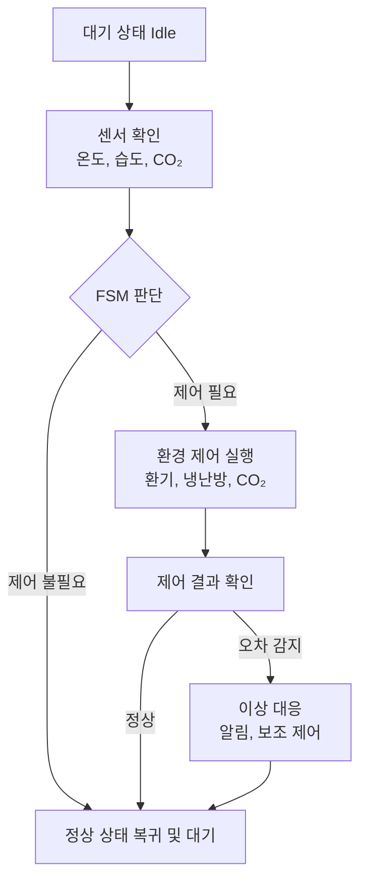

```mermaid
flowchart TD
    A[대기 상태 Idle] --> B[센서 확인<br/>온도, 습도, CO₂]
    B --> C{FSM 판단}
    C -- 제어 필요 --> D[환경 제어 실행<br/>환기, 냉난방, CO₂]
    C -- 제어 불필요 --> G[정상 상태 복귀 및 대기]
    D --> E[제어 결과 확인]
    E -- 정상 --> G
    E -- 오차 감지 --> F[이상 대응<br/>알림, 보조 제어]
    F --> G
```
